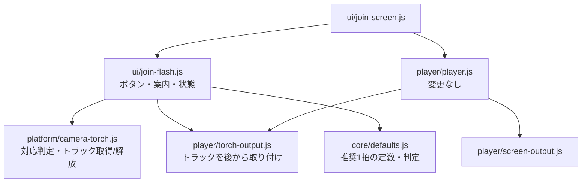

# 設計書

## アーキテクチャ概要

既存の4層構成のまま、出力先(`Output`)を1つ追加する。点灯・消灯の判定(`Player` と `core/`)は変更しない。



- `TorchOutput` は参加画面を作るときに(トラックなしで)生成し、`ScreenOutput` と一緒に `Player` に渡す。カメラを取得したら `attach(track)`、手放すときは `detach()` する。これにより `Player` に出力先の追加・削除の仕組みを足さずに済む(`docs/architecture.md`「Player とドメイン層は変更しない」)
- `join-screen.js` は現在285行で300行の目安に近いため、フラッシュのUIと状態は `ui/join-flash.js` に分ける

## コンポーネント設計

### 1. platform/camera-torch.js

**責務**:
- ブラウザがトーチの制御に対応しているかの事前判定(カメラの許可を求めずに判定できる範囲)
- 背面カメラの映像トラックを取得し、トーチを持つか確かめる
- トラックの解放

**インターフェース**:
```javascript
/** 許可を求めずに判定できる範囲で、トーチ制御に対応していそうか */
export function isTorchLikelySupported(): boolean;
// navigator.mediaDevices?.getSupportedConstraints?.().torch === true

/** 背面カメラを取得し、トーチを持つトラックを返す。例外は投げない */
export async function acquireTorchTrack():
  Promise<{ ok: true, track: MediaStreamTrack }
        | { ok: false, reason: 'unsupported' | 'denied' | 'failed' }>;

export function releaseTorchTrack(track: MediaStreamTrack): void; // track.stop()
```

**実装の要点**:
- `getUserMedia({ video: { facingMode: { ideal: 'environment' } }, audio: false })` で取得する
- `track.getCapabilities?.().torch` が真でなければ、そのトラックを止めて `enumerateDevices()` の他の `videoinput` を順に試す(Androidでは背面カメラが複数あり、トーチ付きでないカメラが選ばれることがあるため)。どれも持たなければ `unsupported`
- `NotAllowedError` / `SecurityError` は `denied`、それ以外の例外は `failed`
- 映像トラックは `<video>` `<canvas>` に接続しない

### 2. player/torch-output.js

**責務**:
- `Output` インターフェース(`setOn` / `dispose`)を実装し、取り付けたトラックのトーチを点灯・消灯する
- 非同期の `applyConstraints` が重なっても、最後に指示された状態に必ず落ち着くようにする

**インターフェース**:
```javascript
export class TorchOutput {
  setOn(isOn: boolean): void;       // Output
  dispose(): void;                  // Output(消灯して detach)
  attach(track: MediaStreamTrack): void; // 現在の指示状態をすぐ反映
  detach(): void;                   // 消灯を試みてから手放す(解放は呼び出し側)
}
```

**実装の要点**:
- `setOn` は「指示された状態」を記録するだけで、同期的に戻る(Player の毎フレーム処理を待たせない)
- 適用中(`applyConstraints` の Promise が未解決)に次の指示が来たら、完了後に最新の指示だけを適用する(古い指示が後から適用されて状態が逆転するのを防ぐ)
- `applyConstraints({ advanced: [{ torch: isOn }] })` の失敗は `console.warn` して次の指示を待つ。点滅(画面)は止めない
- 毎フレーム処理ではないが、`setOn` は状態が変わったときだけ呼ばれる(Player が差分通知するため)

### 3. ui/join-flash.js

**責務**:
- 参加前の画面に出す「フラッシュも使う」ボタンと案内文の要素を作る
- フラッシュのオン/オフの状態を持ち、カメラの取得・解放と `TorchOutput` の取り付け・取り外しを行う
- 非対応・拒否・1拍が短いときの案内を表示する
- メニューから切り替えるための `toggle()`、中断時の `suspend()` / 復帰時の `resume()` を提供する

**インターフェース**:
```javascript
export function createJoinFlash(torchOutput: TorchOutput, unitMs: number): {
  element: HTMLElement;       // 参加前の画面に置く部分(ボタン+案内)
  isEnabled(): boolean;       // 参加者がオンにしているか
  toggle(): Promise<void>;    // オン/オフ切替(オン時にカメラを取得)
  suspend(): void;            // タブ切替時: カメラを解放(オンの選択は保持)
  resume(): Promise<void>;    // 表示復帰時: オンならカメラを取り直す
  onChange(listener: () => void): void; // メニューの文言更新用
  dispose(): void;            // カメラ解放
};
```

**実装の要点**:
- ボタンは `aria-pressed` でオン/オフを表す
- `isTorchLikelySupported()` が偽なら、最初からボタンを無効にして「使えません」を表示する
- オンにした時点でカメラを取得する(PRD「ボタンを押したときに初めてカメラの許可を求める」)。取得中はボタンを無効にし、二重取得を防ぐ
- 取得結果が `unsupported` ならボタンを無効にして「使えません」、`denied` なら拒否の案内を出してオフに戻す
- タブ切替・画面オフ(hidden)ではカメラを解放する。iOSでは背景に回るとカメラが止められ、戻っても自動で再開しないため、戻ったら取り直す

### 4. ui/join-screen.js(変更)

- `TorchOutput` を作り、`ScreenOutput` と一緒に `Player` に渡す
- 参加前の画面に `createJoinFlash(...).element` を置く
- メニューに「フラッシュを使う / フラッシュを止める」を追加(対応していそうな場合のみ)
- `visibilitychange` の hidden で `flash.suspend()`、visible で `flash.resume()`
- アンマウント時に `flash.dispose()`

### 5. ui/join-menu.js(変更)

- 任意の項目「フラッシュ」を追加できるようにする(`onToggleFlash` があるときだけボタンを出す)
- 文言を合わせる `setFlashEnabled(isEnabled)` を追加

### 6. core/defaults.js(変更)

- `TORCH_RECOMMENDED_MIN_UNIT_MS = 300` と、判定関数 `isUnitTooShortForTorch(unitMs)` を追加する(※300msは実機検証で見直す)

### 7. ui/messages.js(変更)

追加する文言:

| キー | 文言 |
|------|------|
| `useFlash` | フラッシュも使う |
| `flashPermissionNote` | フラッシュを使うためにカメラの許可が必要です。撮影・録画はしません |
| `flashUnsupported` | この端末ではフラッシュを使えません |
| `flashDenied` | カメラが許可されなかったため、フラッシュは使えません |
| `flashFailed` | フラッシュを使えませんでした。もう一度お試しください |
| `flashUnitHint` | フラッシュは切り替えが遅れることがあるため、1拍300ms以上をおすすめします |
| `menuFlashOn` / `menuFlashOff` | フラッシュを使う / フラッシュを止める |

## データフロー

### フラッシュをオンにして参加する
```
1. 参加前の画面で「フラッシュも使う」をタップ
2. join-flash が acquireTorchTrack() を呼ぶ → OSのカメラ許可ダイアログ
3. 許可・トーチあり → torchOutput.attach(track)、ボタンをオン表示
   (1拍が300ms未満なら案内を表示)
4. 「タップして参加」→ Player.start()
5. Player が状態の変化時に screenOutput.setOn / torchOutput.setOn を呼ぶ
6. torchOutput が applyConstraints({ advanced: [{ torch }] }) を最新の指示で適用
```

### タブ切替から戻る
```
1. hidden: player.stop()(全出力を消灯)→ flash.suspend()(detach+track.stop)
2. visible: wakeLock 再取得 → flash.resume()(オンなら取り直して attach)→ player.start()
```

## エラーハンドリング戦略

### エラーハンドリングパターン

- `platform/camera-torch.js` は例外を投げず、`{ ok: false, reason }` で返す(開発ガイドライン「プラットフォーム層」)
- `TorchOutput` の `applyConstraints` 失敗は `console.warn` のみ。画面点滅は止めない
- どの失敗でも画面点滅は継続する(PRD 受け入れ条件)

| 状況 | 表示 | ボタン |
|------|------|--------|
| `getSupportedConstraints().torch` が偽 | この端末ではフラッシュを使えません | 無効 |
| 取得したがトーチなし(`unsupported`) | この端末ではフラッシュを使えません | 無効 |
| 許可を拒否(`denied`) | カメラが許可されなかったため、フラッシュは使えません | オフに戻す(再度押せば再試行) |
| その他の失敗(`failed`) | フラッシュを使えませんでした。もう一度お試しください | オフに戻す |

## テスト戦略

### ユニットテスト
- `core/defaults.js` の `isUnitTooShortForTorch`: 299ms → 真、300ms → 偽、境界値

`player/` `platform/` `ui/` は開発ガイドラインの方針どおり自動テストの対象外とし、以下で確認する。

### 統合テスト(ブラウザでの手動確認)
- PCのブラウザ: ボタンが無効で「使えません」と表示、画面点滅は従来どおり
- 許可ダイアログが「フラッシュも使う」を押すまで出ないこと
- 点滅中のネットワーク通信がないこと、コンソールエラーがないこと

### 実機確認(開発者がiPhoneで実施)
- トーチが点滅するか、または「使えません」表示になるか(PRD 未決定事項5の結論)
- 光る場合: 画面点滅との揃い方、QR表示・一時停止・タブ切替からの復帰
- 許可の拒否時の表示

## 依存ライブラリ

追加なし。

## ディレクトリ構造

```
public/js/
├── core/defaults.js          # 変更: TORCH_RECOMMENDED_MIN_UNIT_MS / isUnitTooShortForTorch
├── platform/camera-torch.js  # 追加
├── player/torch-output.js    # 追加
└── ui/
    ├── join-flash.js         # 追加
    ├── join-screen.js        # 変更
    ├── join-menu.js          # 変更
    └── messages.js           # 変更
public/css/style.css          # 変更: フラッシュのボタン・案内のスタイル
tests/unit/core/defaults.test.js  # 追加
```

## 実装の順序

1. `core/defaults.js` の定数と判定、テスト
2. `platform/camera-torch.js`
3. `player/torch-output.js`
4. `ui/messages.js` の文言
5. `ui/join-flash.js`
6. `ui/join-menu.js` の項目追加
7. `ui/join-screen.js` への組み込み、CSS
8. 品質チェック、ブラウザでの確認、ドキュメント更新

## セキュリティ考慮事項

- カメラはフラッシュを使うと参加者が選んだときだけ取得する
- 映像トラックを `<video>` `<canvas>` に接続しない。映像のフレームを読む処理を書かない
- フラッシュをオフにしたとき・中断時・画面を離れるときに `track.stop()` で解放する(OSのカメラ使用中表示を残さない)
- CSP の変更は不要(カメラの取得は `connect-src` などの対象外)

## パフォーマンス考慮事項

- `TorchOutput.setOn` は同期的に戻り、`applyConstraints` を待たない(毎フレームの処理を止めない)
- 適用が重なったときは最新の指示だけを適用し、古い指示を溜めない

## 将来の拡張性

- 実機でトーチの遅延が分かったら、`TorchOutput` 用に「少し先の時刻の状態」を渡す補正を検討する。その場合は `Player` に出力先ごとの先読み時間を持たせる変更になる
- 画面を消灯したままフラッシュだけを使うモードは、`ScreenOutput` を渡さない構成で実現できる
