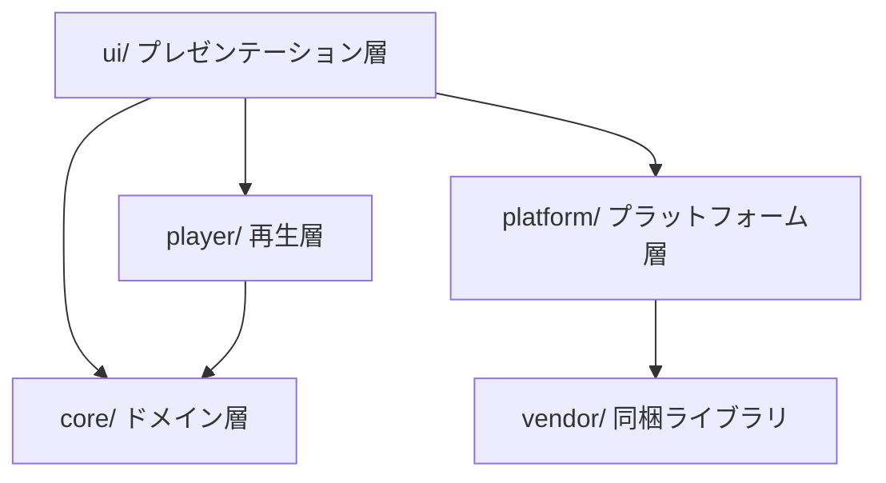

# 技術仕様書 (Architecture Design Document)

本書は `docs/product-requirements.md`(PRD)と `docs/functional-design.md`(機能設計書)を実現するための、技術構成・構造・制約を定義する。

## 基本方針

| 方針 | 内容 | 理由 |
|------|------|------|
| 静的ファイルのみ | サーバー側の処理・データベース・APIを持たない | GitHub Pagesで無料公開でき、運用コストがゼロになる(PRD 提供する価値) |
| ビルドなし | 配信するファイルは書いたソースそのもの。トランスパイル・バンドル・圧縮をしない | 修正してすぐ反映でき、仕組みが単純。配信物の中身を誰でも確認できる |
| 実行時の依存ゼロ(同梱1本を除く) | npmパッケージを配信物に含めない。QRコード生成ライブラリ1本のみ、ファイルとして同梱する | 転送量100KB以内(PRD 非機能要件)と、外部CDNを使わない方針のため |
| 開発ツールは開発時だけ | テスト・静的解析・型検査・整形のツールは `devDependencies` に置き、配信物には含めない | 品質を保ちつつ、配信物を軽く保つ |
| 通信なし | 読み込み後は一切通信しない | 同期に通信を使わない設計であり、プライバシーとオフライン動作(P1)の前提 |

## テクノロジースタック

### 言語・ランタイム

| 技術 | バージョン | 選定理由 |
|------|-----------|----------|
| JavaScript | ES2022(ES Modules) | 対象ブラウザ(iOS 16.4以降のSafari、最新のChrome等)がそのまま実行できる。`<script type="module">` でファイル分割でき、ビルドなしで構造化できる |
| HTML / CSS | HTML Living Standard / CSS3 | 点滅は背景色の切替だけで済み、特別な描画技術が不要 |
| SVG | 1.1 | QRコードを拡大しても粗くならず、画面いっぱいに表示しても読み取りやすい |
| Node.js(開発時のみ) | v24 LTS(devcontainerの `lts` 指定) | テスト・静的解析ツールの実行に使う。配信物は依存しない |
| npm(開発時のみ) | 11.x | Node.js v24に同梱。`package-lock.json` で開発ツールのバージョンを固定する |

ES2022を上限とする理由: iOS 16.4のSafariが対応する範囲に収めるため。これより新しい構文(例: `Array.prototype.toSorted` 以降の追加機能の一部)を使う場合は、対象ブラウザでの対応を確認してから使う。

### ブラウザAPI

| API | 用途 | 対応状況の扱い |
|-----|------|--------------|
| `Date.now()` | 同期の基準時刻 | 全ブラウザ対応。端末間で共有できる唯一の基準 |
| `requestAnimationFrame` | 毎フレームの点灯判定 | 全ブラウザ対応 |
| Screen Wake Lock API | スリープ防止 | iOS 16.4以降・Chrome対応。非対応なら案内表示のみ(機能設計書 エラーハンドリング) |
| Fullscreen API | 全画面表示 | iPhone Safariは非対応。非対応なら通常表示で継続 |
| Web Share API | 共有シート | 非対応ならClipboard APIでコピー |
| Clipboard API(`writeText`) | URLのコピー | 失敗時は、作成画面では「QRコードの中身」のウインドウへ案内し、参加画面のQR表示ではURLを選択可能なテキストで表示 |
| `hashchange` / `visibilitychange` | 設定の切替 / 中断・復帰 | 全ブラウザ対応 |
| MediaDevices.getUserMedia + `torch` 制約(P1) | フラッシュ制御 | Android Chrome対応。iOSは26.5のSafariで動作確認済み(PRD 未決定事項5) |
| Service Worker + Cache Storage(P1) | オフライン対応 | 全対象ブラウザ対応。HTTPS必須 |

### フレームワーク・ライブラリ(配信物に含めるもの)

| 技術 | バージョン | 用途 | 選定理由 |
|------|-----------|------|----------|
| qrcode-generator | 同梱時点の最新版に固定(版はファイル先頭に記載) | QRコード生成 | MIT。依存なしの単一ファイルでブラウザで直接読み込める。誤り訂正レベルやモジュール単位の出力ができ、SVGを自前で組み立てられる |

UIフレームワーク(React等)は使わない。画面は作成・参加の2つだけで、状態遷移も機能設計書の図の範囲に収まるため、DOMを直接操作するほうが軽く単純である。

### 開発ツール(配信物に含めないもの)

リポジトリに既存の `package.json` の開発ツールを、JavaScript向けに設定を変えて使う。

| 技術 | バージョン | 用途 | 選定理由 |
|------|-----------|------|----------|
| Vitest | 2.x | ドメイン層のユニットテスト | ES Modulesをそのまま読み込めるので、配信用の `.js` を変換なしでテストできる |
| TypeScript(`tsc --noEmit`) | 5.3.x | JSDocによる型検査 | `allowJs` + `checkJs` でJavaScriptを型検査だけする。出力はしない(ビルドなしの方針を保つ) |
| ESLint | 9.x | 静的解析 | 未使用変数・未定義参照などの誤りを検出 |
| Prettier | 3.x | コード整形 | 書式の議論をなくす |
| husky + lint-staged | 9.x / 15.x | コミット前チェック | コミット前に整形・静的解析・型検査・テストを自動実行 |
| GitHub Actions | - | テストとGitHub Pagesへの公開 | 配信用ディレクトリをそのままアップロードする(変換はしない) |

## アーキテクチャパターン

### レイヤー構成

```
┌─────────────────────────────────────────────┐
│ プレゼンテーション層  (ui/)                    │ ← 画面の組み立て、ユーザー操作、状態遷移
│   Router / CreateScreen / JoinScreen          │
├─────────────────────────────────────────────┤
│ 再生層  (player/)                              │ ← 毎フレームの点灯判定と出力先への通知
│   Player / ScreenOutput / TorchOutput(P1)     │
├──────────────────────┬──────────────────────┤
│ ドメイン層 (core/)     │ プラットフォーム層      │
│  ConfigCodec          │  (platform/)          │
│  MorseEncoder         │  WakeLockKeeper       │
│  Timeline             │  FullscreenHelper     │
│  PeriodPlanner        │  ShareHelper          │
│  SyncClock            │  QrView               │
│  変換表 (core/tables/) │                       │
└──────────────────────┴──────────────────────┘
```

#### プレゼンテーション層(`ui/`)
- **責務**: DOMの組み立てと更新、ユーザー操作の受付、画面の状態遷移の管理、文言の表示
- **許可される操作**: 再生層・ドメイン層・プラットフォーム層の呼び出し
- **禁止される操作**: モールスの規則・周期の計算・URLの書式をこの層で直接扱うこと(必ずドメイン層を呼ぶ)

#### 再生層(`player/`)
- **責務**: `requestAnimationFrame` のループ、`Date.now()` の読み取り、点灯状態が変わったときの出力先への通知
- **許可される操作**: ドメイン層(`stateAt` など)の呼び出し。出力先(`Output` インターフェース)への通知
- **禁止される操作**: 画面の文言やボタンの操作。出力先の具体的な実装(画面・トーチ)への依存は `Output` インターフェース越しに限る

#### ドメイン層(`core/`)
- **責務**: 変換表、正規化、符号化、点灯区間の展開、周期の決定、時刻からの点灯判定、URLハッシュの変換と検証
- **許可される操作**: 同じ層の関数・変換表の参照のみ
- **禁止される操作**: `window` / `document` / `navigator` / `Date.now()` / `location` の参照。現在時刻は引数で受け取る(テストで任意の時刻を与えられるようにするため)

#### プラットフォーム層(`platform/`)
- **責務**: ブラウザAPIの薄いラッパー。対応判定と失敗時の吸収(例外を投げず結果を返す)
- **許可される操作**: ブラウザAPIの呼び出し、同梱ライブラリ(QR)の呼び出し
- **禁止される操作**: ドメイン層・画面の状態への依存

### 依存の方向



- 依存は上から下への一方向のみ。`core/` は他のどの層にも依存しない
- 違反(例: `core/` から `document` を参照)はESLintの `no-restricted-globals` で検出する(`docs/development-guidelines.md` で定義)

### 起動の流れ

```
index.html
 └─ <script type="module" src="./js/main.js">
     └─ main.js: startRouter(document.getElementById('app'))
         ├─ ハッシュなし  → ui/create-screen.js
         └─ ハッシュあり  → core/config-codec.js で検証 → ui/join-screen.js
```

- `index.html` は1つだけ。画面の切替はハッシュで行い、ページの再読み込みをしない
- モジュールは `import` で静的に読み込む。ファイル数が少ない(十数本)ため、HTTP/2で配信されるGitHub Pagesでは分割による遅延は小さい

## データ永続化戦略

### ストレージ方式

| データ種別 | ストレージ | フォーマット | 理由 |
|-----------|----------|-------------|------|
| 点滅パターンの設定 | URLのハッシュ(`#` 以降) | `v=1&l=en&m=…&p=…&u=…&c=…` | QRコード・共有URLだけで設定を配れる。ハッシュはサーバーに送信されない |
| 変換表 | ソースコード(`core/tables/*.js`) | JavaScriptのオブジェクト | ビルドなしで読み込める。JSONを `fetch` するとオフライン対応(P1)や初回の往復が増えるため、モジュールとして持つ |
| ページ一式(P1) | Cache Storage(Service Worker) | HTTPレスポンス | 一度開けば圏外でも開けるようにする |

- サーバー・`localStorage`・IndexedDB・Cookieにユーザーのデータを保存しない
- 作成画面の入力途中の内容も保存しない(ハッシュに反映したURLを主催者が控えれば再現できる)

### バックアップ戦略

ユーザーデータを保持しないため、データのバックアップは不要。ソースコードとドキュメントはGitリポジトリ(GitHub)で管理する。

### URL仕様の互換性

URLは配布後に手元に残るQRコードの中身であり、実質的な公開データ形式として扱う。

- 仕様バージョン `v=1` のURLは、以降のすべての版のページで同じ動作を保証する
- 項目の追加は、省略時の既定値で旧URLと同じ動作になる場合に限り `v` を上げずに行える
- 既存項目の意味・書式・計算方法(周期の決定を含む)を変える場合は `v` を上げる。旧版の読み込み処理は残す
- 読み込み側は未知のキーを無視する

## パフォーマンス要件

### レスポンスタイム

| 操作 | 目標 | 測定方法・環境 |
|------|------|--------------|
| 参加画面の「タップして参加」表示 | 3秒以内 | Chrome DevToolsのネットワーク制限「Fast 4G」、キャッシュなし。Lighthouseの計測値で確認 |
| QR読み取りから「待機中」表示 | 10秒以内 | 実機(4G回線)、ユーザーテストで計測(PRD KPI) |
| 作成画面の入力から符号・所要時間の表示更新 | 50ms以内 | 50文字入力時、DevToolsのPerformanceで計測 |
| 作成画面のQRコード再生成 | 入力停止から200ms以内 | 同上(100msの間引き+生成時間) |
| 点灯・消灯の切替のずれ | 計算上の時刻から1フレーム以内(60Hzで約17ms) | ユニットテストで判定ロジック、実機のスロー動画で表示を確認 |
| 端末間の点灯開始のずれ | 最大100ms | 異なる機種5台以上、240fpsのスロー動画(PRD KPI) |

### リソース使用量

| リソース | 上限 | 理由・測定方法 |
|---------|------|--------------|
| 初回の転送量 | 100KB以内(gzip後、全ファイル合計) | 会場の回線混雑対策(PRD)。CIでファイルサイズの合計を検査する |
| 点滅中の通信 | 0バイト | DevToolsのネットワークタブで確認 |
| 1フレームあたりの処理 | 2ms以内 | `Date.now()`・二分探索・比較のみ。DevToolsのPerformanceで確認 |
| 点滅中のフレーム落ち | 1分あたり5回以下 | 中級機種(iPhone SE 第2世代 / Pixel 6a)で計測(PRD) |
| メモリ | 20MB以内(JSヒープ) | 点滅中にオブジェクトを生成しない。DevToolsのMemoryで確認 |

### 同期精度を左右する要因と対策

| 要因 | 影響 | 対策 |
|------|------|------|
| 端末の時計のずれ | 端末間の開始時刻のずれに直結 | 対策は端末側に委ねる(自動時刻設定)。参加画面のヘルプで案内。1拍200ms以上でずれを目立たなくする |
| 画面の更新間隔 | 最大1フレームの遅れ | 毎フレーム判定する。1拍200ms以上に対し約17msは小さい |
| タブのスロットリング | 背景タブでrAFが止まる | 非表示時は停止し、表示復帰時に次の開始時刻から再開 |
| 誤差の蓄積 | 長時間でずれが拡大 | 前回からの経過を積み上げず、毎回 `Date.now()` から計算 |
| 時計の補正(NTPによる時刻の飛び) | 一瞬のずれ | 毎フレーム再計算するため、補正後はただちに正しい位置に戻る |

## セキュリティアーキテクチャ

### データ保護

- **収集しない**: アクセス解析・広告・外部スクリプトを使わない。ユーザーの入力はURLのハッシュにしか存在せず、ハッシュはHTTPリクエストに含まれないため、GitHub Pagesのアクセスログにも残らない
- **HTTPS**: GitHub Pagesの「Enforce HTTPS」を有効にする(Wake Lock・カメラ・Service Workerの利用条件)
- **機密情報**: APIキー等の機密情報は存在しない。リポジトリにも置かない

### 入力検証

- **検証の場所**: URLから読んだ値・作成画面の入力はすべて `core/config-codec.js` で検証し、検証を通った `PatternConfig` だけを他の層に渡す
- **検証内容**: 機能設計書「アルゴリズム5」の通り、バージョン・文字種・メッセージ(文字数と対応文字)・1拍(整数と範囲)・色(16進6桁)・周期(1〜60の整数と所要時間)
- **出力時の無害化**: 文字列の表示は `textContent` のみ。`innerHTML`・`eval`・`new Function`・`document.write` は使わない(ESLintで禁止)
- **CSSへの埋め込み**: 点灯色は検証済みの16進6桁のみを `#` を付けて `style.backgroundColor` に設定する

### コンテンツセキュリティポリシー

GitHub PagesではHTTPヘッダーを設定できないため、`index.html` の `<meta http-equiv="Content-Security-Policy">` で指定する。

```
default-src 'self';
script-src 'self';
style-src 'self';
img-src 'self' data:;
connect-src 'none';
object-src 'none';
base-uri 'self';
form-action 'none'
```

- `connect-src 'none'` により、誤って通信処理を入れても実行時に遮断される
- インラインスクリプト・インラインの `<style>` は使わない(CSSは外部ファイル、動的な色は `element.style` で設定する)
- P1でService Workerを導入する際は `worker-src 'self'` を追加する

### カメラ(P1)

- `getUserMedia({ video: { facingMode: 'environment' } })` は「フラッシュも使う」を押したときだけ呼ぶ
- 映像トラックを `<video>` や `<canvas>` に接続しない
- フラッシュをオフにしたとき・参加画面を離れたときに `track.stop()` でカメラを解放する

## スケーラビリティ設計

### 参加者数の増加への対応

- **同期**: 通信を使わないため、参加者が何人でも各端末の処理は同じ(PRD 信頼性)
- **配信**: 負荷はGitHub Pages(CDN配信)に集中する。1アクセス100KB以内のため、1時間1,000アクセスで約100MB。GitHub Pagesの帯域の目安(月100GB)に対して十分余裕がある
- **一斉アクセス**: 会場で同時に読み込まれても、静的ファイルのためサーバー処理のボトルネックはない。転送量の小ささが回線混雑への主な対策であり、P1のオフライン対応で当日の通信自体をなくせる

### データ量の上限

| 項目 | 上限 | 根拠 |
|------|------|------|
| メッセージ | 50文字 | PRD。URLが短いほどQRコードが粗く読み取りやすい |
| URLの長さ | 約250文字 | 50文字の記号をすべてURLエンコードした場合の最大(`%XX` × 50 + 固定部分)。QRコード(誤り訂正M)で読み取りに支障のない範囲 |
| 点灯区間の数 | 約350 | 50文字 × 1文字あたり最大7要素(`$`) |

### 機能拡張性

| 拡張 | 対応方法 | 変更範囲 |
|------|---------|---------|
| 和文モールス(P1) | `core/tables/ja.js` を追加し、`l=ja` で選ぶ | 変換表の追加、`ConfigCodec` の許可する `l` の追加、作成画面の切替UI |
| フラッシュ(P1) | `player/torch-output.js` で `Output` インターフェースを実装 | 出力先の追加、参加画面のボタン。`Player` とドメイン層は変更しない |
| 音(P2) | `player/beep-output.js` で `Output` を実装(Web Audio API) | 同上 |
| オフライン(P1) | `sw.js` とWebアプリマニフェストを追加 | 配信物の追加、CSPの `worker-src` |
| URL項目の追加 | 「URL仕様の互換性」の規則に従う | `ConfigCodec` |

## テスト戦略

### ユニットテスト
- **フレームワーク**: Vitest(`environment: 'node'`)
- **対象**: ドメイン層(`core/`)のすべての関数。DOMに依存しないため、配信用のファイルをそのままimportしてテストする
- **カバレッジ目標**: `core/` の行・分岐カバレッジ 90%以上(既存の全体閾値80%に加え、同期の正しさを担う層として高めに設定)
- **観点**: 機能設計書「テスト戦略」の通り。特に周期の境界値、時刻の境界(ちょうど・前後1ms)、1時間後の判定、URLの往復変換

### 統合テスト
- **方法**: ローカルの静的サーバー(`npm run serve`。`scripts/serve.js`、開発時のみ)で開き、ブラウザで手動確認する
- **対象**: 画面遷移、Wake Lock・フルスクリーン・共有の動作と失敗時の表示、通信が発生しないこと
- **チェックリスト**: 機能設計書「統合テスト」の項目を `.steering/` の作業ごとの `tasklist.md` に写して実施記録を残す

### E2Eテスト(実機検証)
- **ツール**: 実機+スロー動画(240fps)。自動化ツールは導入しない(同期精度・フラッシュ・QR読み取りは実機でしか確かめられないため)
- **シナリオ**: 機能設計書「E2Eテスト」の通り(動作環境・同期精度・QR読み取り・長時間動作・参加のしやすさ)
- **実施時期**: MVP公開前、およびドメイン層・再生層を変更したとき

### CI(GitHub Actions)
- プルリクエスト・`main` へのpushで、静的解析・型検査・ユニットテスト・配信物のサイズ検査を実行する
- `main` へのpushでテストが通った場合のみ、`public/` をGitHub Pagesに公開する

## 技術的制約

### 環境要件

| 区分 | 要件 |
|------|------|
| 利用者の端末 | iOS 16.4以降のSafari(およびiOS上の他ブラウザ)、Android 10以降のChrome、PCのChrome / Edge / Safari / Firefox 最新版(PRD 動作環境) |
| 利用者の設定 | 端末の時刻が自動設定であること(同期精度の前提) |
| 開発環境 | devcontainer(Node.js LTS、npm)。ブラウザでの確認用にローカル静的サーバー |
| 公開環境 | GitHub Pages(HTTPS)。GitHub Actionsによるデプロイ |
| 外部依存 | 実行時はなし(QRライブラリは同梱) |

### パフォーマンス制約
- ブラウザから画面の輝度は変更できない(案内表示で対応)
- 背景タブ・画面オフ中は `requestAnimationFrame` が止まり、Wake Lockも解除される(復帰時に再開)
- 端末間の同期精度は、各端末の時計の精度を超えられない
- トーチの切替には端末ごとの遅延がある(P1。1拍250ms以上を推奨。iOS 26.5では250msで画面とそろうことを確認)

### セキュリティ制約
- Wake Lock・カメラ・Service Workerの利用にはHTTPSが必須
- Wake Lock・フルスクリーン・共有・カメラの許可要求は、ユーザー操作(タップ)のイベント内で呼ぶ必要がある
- GitHub PagesではHTTPレスポンスヘッダーを設定できない(CSPは `<meta>` で指定)

### 光過敏への配慮による制約
- 1拍の下限200msを変更しない。点滅は1秒あたり3回以下(WCAG 2.3.1)を守る

## 依存関係管理

| ライブラリ | 区分 | 用途 | バージョン管理方針 |
|-----------|------|------|-------------------|
| qrcode-generator | 配信物に同梱 | QRコード生成 | 特定の版のファイルを `public/vendor/` にコピーして固定。ファイル先頭にライブラリ名・版・ライセンス・取得元を記載。更新は手動で、QRの読み取り確認をしてから行う |
| vitest | devDependencies | テスト | `^2.0.0`(既存設定を維持) |
| typescript | devDependencies | 型検査 | `~5.3.0`(パッチのみ自動、既存設定を維持) |
| eslint / typescript-eslint / eslint-config-prettier | devDependencies | 静的解析 | `^`(マイナーまで自動) |
| prettier | devDependencies | 整形 | `^3.2.0` |
| husky / lint-staged | devDependencies | コミット前チェック | `^` |

- `package-lock.json` をコミットし、開発者間・CIでバージョンを揃える
- `dependencies`(実行時の依存)は空のまま保つ。npmパッケージを配信物に含める変更は、本書の「基本方針」の変更として扱う
