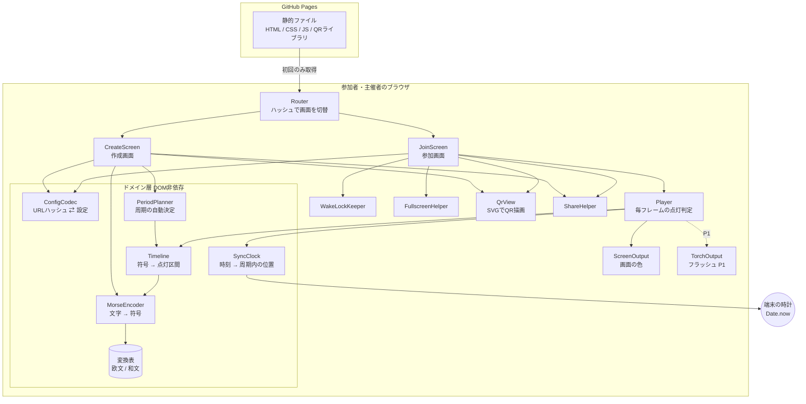
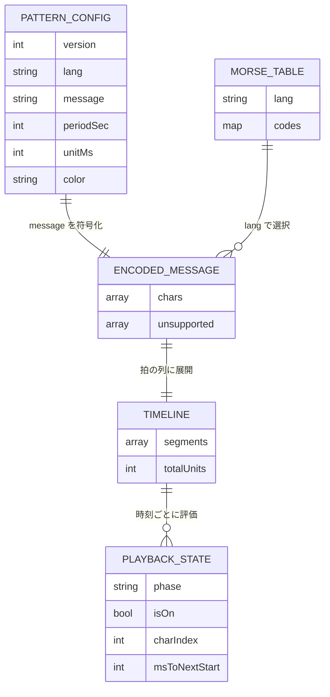
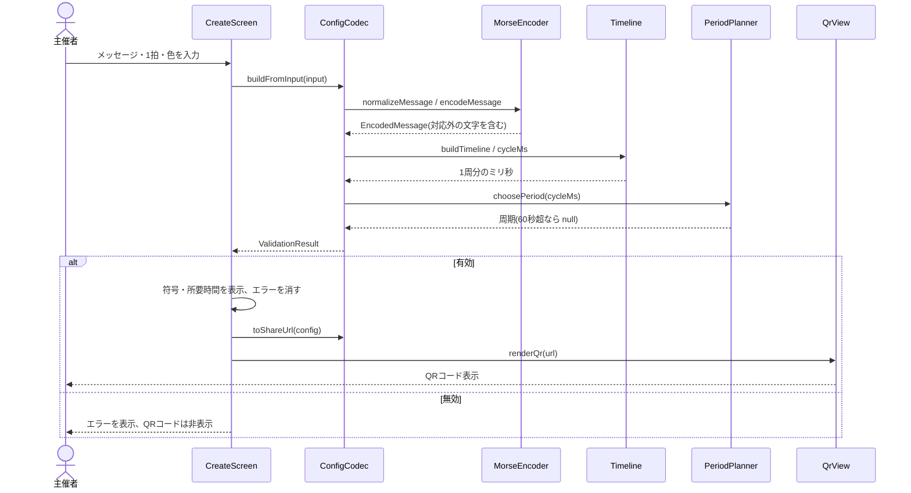
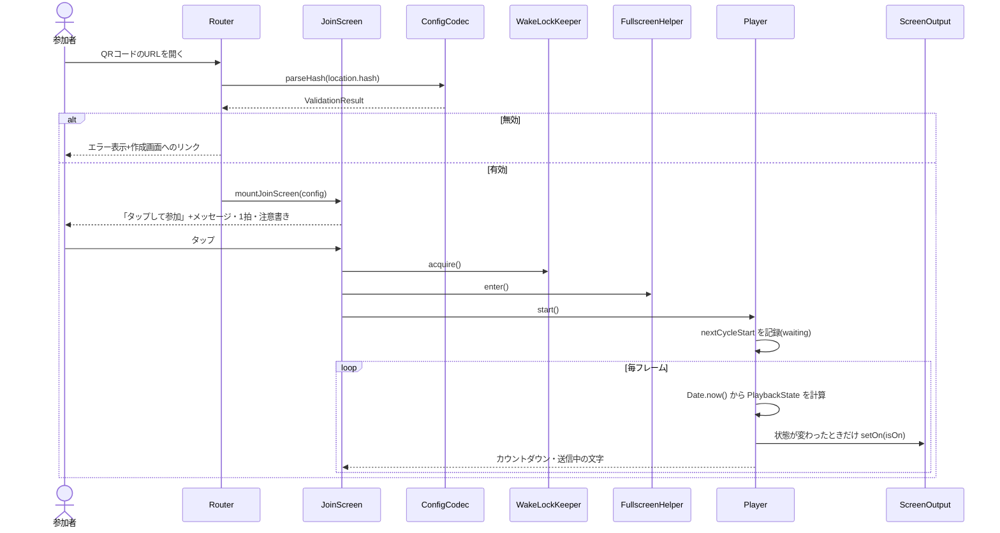
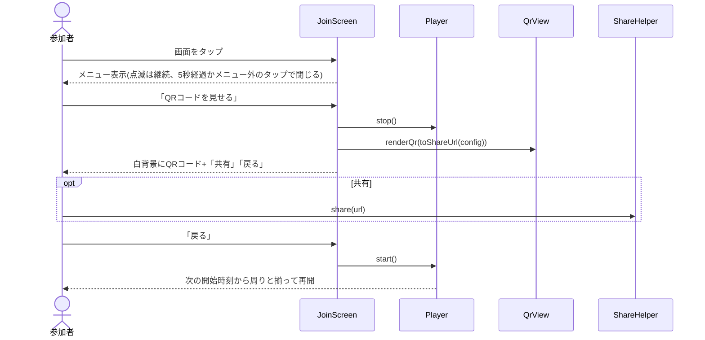
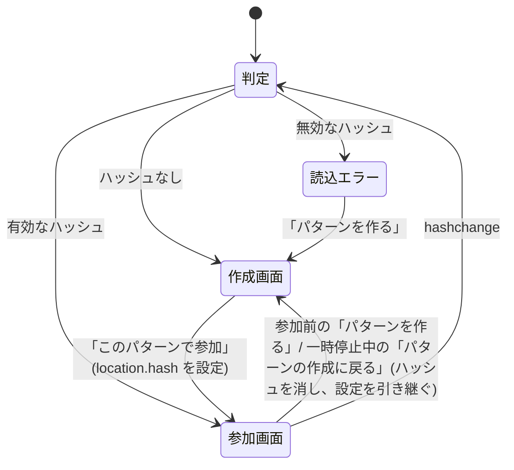
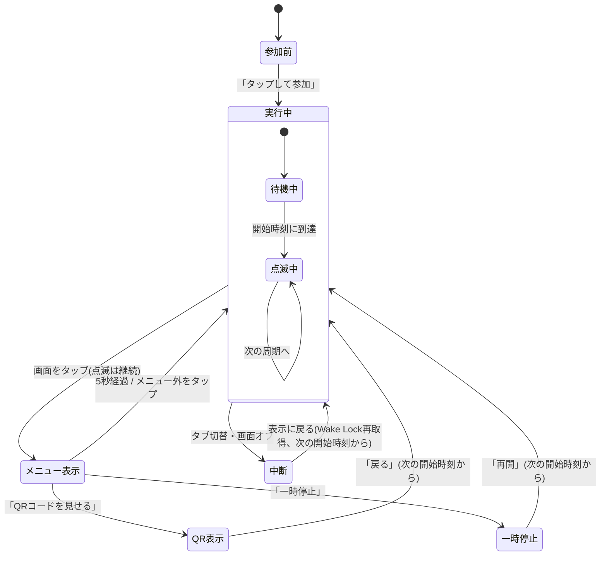

# 機能設計書 (Functional Design Document)

本書は `docs/product-requirements.md`(以下PRD)で定義した要件を、どう実現するかを定義する。
MVP(P0: 機能1〜5)を中心に詳細化し、P1(フラッシュ・PWA・和文)は拡張点として設計に含める。

## システム構成図

サーバー側の処理は持たない。GitHub Pagesから静的ファイルを配信し、以降の処理はすべてブラウザ内で完結する。



**設計の要点**:
- **ドメイン層はDOMに依存しない**: 符号化・タイミング計算・周期決定・URL変換は純粋な関数として実装し、Node.js上のユニットテストで検証できるようにする
- **点灯判定と出力先の分離**: Playerは「今点灯か消灯か」だけを決め、画面・フラッシュ(P1)・音(P2)などの出力先に通知する(PRD 拡張性「同期の仕組みの共通化」)
- **時刻の唯一の基準は `Date.now()`**: 端末間で共有できる基準は壁時計(UNIX時刻)だけであるため。`performance.now()` は端末ごとに起点が異なるので同期の基準には使わない

## 技術スタック

| 分類 | 技術 | 選定理由 |
|------|------|----------|
| 言語 | JavaScript(ES2022、ES Modules) | ビルドツールなしでブラウザがそのまま読み込める |
| 型の表現 | JSDoc | ビルドなしで型の意図を残し、エディタの補完を効かせるため |
| 描画 | HTML / CSS / SVG | 点滅は背景色の切替、QRコードはSVGで描画し拡大しても粗くならない |
| QRコード生成 | qrcode-generator(MIT、gzip後で十数KB程度)をリポジトリに同梱 | 依存なしの単一ファイルで、外部CDNを使わず同一オリジンから配信できる |
| ブラウザAPI | Screen Wake Lock API / Fullscreen API / Web Share API / Clipboard API | スリープ防止・全画面・共有をインストールなしで実現する |
| ブラウザAPI(P1) | MediaDevices.getUserMedia + `torch` 制約 / Service Worker | フラッシュ制御・オフライン対応 |
| テスト | Vitest(開発時のみ、配信物には含めない) | ドメイン層の純粋関数をNode.js上で検証する |
| 公開 | GitHub Pages | 静的ファイルのみ、HTTPS、無料 |

## データモデル定義

実装はJavaScriptだが、構造を明確にするため型をTypeScript記法で示す(実装ではJSDocの `@typedef` で同じ内容を記述する)。

### エンティティ: PatternConfig(点滅パターンの設定)

URLのハッシュに格納する設定そのもの。作成画面で組み立て、参加画面で読み込む。

```typescript
interface PatternConfig {
  version: 1;             // 仕様バージョン(URLの v)。現在は 1 のみ
  lang: 'en';             // 文字の種類(URLの l)。P1で 'ja' を追加
  message: string;        // 正規化済みメッセージ(URLの m)。1〜50文字
  periodSec: PeriodSec;   // 同期の周期・秒(URLの p)。内部で自動決定
  unitMs: number;         // 1拍の長さ・ミリ秒(URLの u)。200〜2000の整数
  color: string;          // 点灯色(URLの c)。小文字16進6桁、'#'なし 例: 'ffcc00'
}

// 1〜60の整数(秒)。以前の版は60の約数に限っていた
type PeriodSec = number;
```

**制約**:
- `message` は正規化後の値を保持する(正規化ルールは「アルゴリズム設計」参照)
- `periodSec * 1000 >= cycleMs`(1周分の所要時間)を満たすこと
- 既定値: `lang='en'`, `unitMs=250`, `color='ffcc00'`(URLで省略された場合に補う)

### エンティティ: MorseTable(変換表)

文字→符号の対応表。プログラム本体から分離したデータとして持つ(PRD 拡張性「変換表の分離」)。

```typescript
interface MorseTable {
  lang: 'en' | 'ja';                 // 文字の種類
  codes: Record<string, string>;     // 文字 → 符号。'.' が短点、'-' が長点 例: { A: '.-' }
  normalize: (input: string) => string; // 表を引く前の正規化(大文字化など)
}
```

- 符号は内部では `.` と `-` で持ち、画面表示時に `・` と `−` に置き換える
- 空白は表に含めず、エンコーダーが単語の区切りとして扱う

### エンティティ: EncodedMessage(符号化結果)

```typescript
interface EncodedMessage {
  chars: EncodedChar[];      // 入力順の文字列(空白を含む)
  unsupported: string[];     // 対応外の文字(重複なし、出現順)。空なら全文字送信可能
}

interface EncodedChar {
  char: string;              // 元の文字(正規化後) 例: 'S'、空白は ' '
  code: string | null;       // 符号 例: '...'。空白は ''、対応外は null
  sourceIndex: number;       // 正規化後メッセージ内の位置(強調表示・送信中表示に使う)
}
```

### エンティティ: Timeline(点灯区間の列)

1周分の点灯区間を、周期の開始からの拍数で表したもの。

```typescript
interface Timeline {
  segments: OnSegment[];     // 点灯区間。開始拍の昇順
  totalUnits: number;        // 1周分の拍数(末尾の区切り7拍を含む)
}

interface OnSegment {
  startUnit: number;         // 点灯開始(周期開始からの拍数)
  endUnit: number;           // 消灯する拍数(この拍の瞬間は消灯)
  charIndex: number;         // どの文字の一部か(EncodedChar.sourceIndex)
}
```

### エンティティ: PlaybackState(ある時刻の再生状態)

Playerが毎フレーム計算する値。保存はしない。

```typescript
interface PlaybackState {
  phase: 'waiting' | 'playing';  // 最初の開始時刻前は waiting
  isOn: boolean;                  // 点灯しているか
  charIndex: number | null;       // 送信中の文字(区切り・待機中は null)
  msToNextStart: number;          // 次の開始時刻までのミリ秒(カウントダウン表示用)
}
```

### エンティティ: ValidationResult(入力・URLの検証結果)

```typescript
type ValidationResult =
  | { ok: true; config: PatternConfig; cycleMs: number }
  | { ok: false; errors: ValidationError[] };

interface ValidationError {
  code: 'UNSUPPORTED_CHARS' | 'EMPTY_MESSAGE' | 'MESSAGE_TOO_LONG'
      | 'UNIT_OUT_OF_RANGE' | 'TOO_LONG_FOR_60S' | 'INVALID_COLOR'
      | 'UNKNOWN_VERSION' | 'UNKNOWN_LANG' | 'MISSING_FIELD' | 'INVALID_PERIOD';
  detail?: string;               // 例: 対応外の文字 'あ'
}
```

### データの関係

永続化するデータはない(PRD スコープ外「パターンの保存」)。データは次の順に変換されるだけである。



## コンポーネント設計

### ドメイン層(DOM非依存・ユニットテスト対象)

#### MorseEncoder

**責務**:
- メッセージを正規化し、変換表を引いて文字ごとの符号に変換する
- 対応外の文字を検出する

**インターフェース**:
```typescript
function normalizeMessage(input: string, table: MorseTable): string;
function encodeMessage(normalized: string, table: MorseTable): EncodedMessage;
function formatCode(code: string): string;   // '.-' → '・−'(表示用)
function formatEncodedMessage(encoded: EncodedMessage): string; // 作成画面の符号表示。文字は空白区切り、単語の区切りは '/'、対応外は '?'
```

- 文字はコードポイント単位で扱う(絵文字を1文字として報告し、文字数・`sourceIndex` もコードポイントで数える)

**依存関係**:
- 変換表(`tables/en.js`、P1で `tables/ja.js`)

#### Timeline

**責務**:
- 符号化結果を、ITU-R M.1677の比率に従って点灯区間の列に展開する
- 1周分の拍数・ミリ秒を求める

**インターフェース**:
```typescript
function buildTimeline(encoded: EncodedMessage): Timeline;   // 符号が null(対応外)の文字は無視する
function cycleMsOf(timeline: Timeline, unitMs: number): number; // totalUnits * unitMs
function findSegment(segments: OnSegment[], elapsedUnits: number): OnSegment | null; // 二分探索
```

#### PeriodPlanner

**責務**:
- 1周分の所要時間から、同期の周期(所要時間を秒単位で切り上げた値)を自動決定する
- 参加側で、URLの周期が妥当か判定する

**インターフェース**:
```typescript
const MAX_PERIOD_SEC = 60;
function choosePeriod(cycleMs: number): PeriodSec | null; // 60秒を超えると null
function isValidPeriod(periodSec: number, cycleMs: number): boolean;
```

#### SyncClock

**責務**:
- 現在時刻と周期から、周期の開始時刻・周期内の経過時間を求める

**インターフェース**:
```typescript
function currentCycleStart(nowMs: number, periodMs: number): number; // floor
function nextCycleStart(nowMs: number, periodMs: number): number;    // ceil
```

#### ConfigCodec

**責務**:
- PatternConfig とURLハッシュ文字列を相互変換する
- URLから読み込んだ値を検証する(PRD 機能3)

**インターフェース**:
```typescript
function toHash(config: PatternConfig): string;          // '#v=1&l=en&m=HELLO&p=14&u=250&c=ffcc00'
function toShareUrl(config: PatternConfig, baseUrl: string): string;
function parseHash(hash: string): ValidationResult;      // 参加画面用
function buildFromInput(input: CreateInput): ValidationResult; // 作成画面用(周期を自動決定)
function previewInput(input: CreateInput): MessagePreview;     // 作成画面の表示用(エラーがあっても符号・所要時間を出す)
function buildConfigTimeline(config: PatternConfig): Timeline; // 参加画面の再生用
```

```typescript
interface MessagePreview {
  normalized: string;        // 正規化後のメッセージ
  encoded: EncodedMessage;   // 符号化結果(対応外の文字の強調表示に使う)
  cycleMs: number | null;    // 1周分の所要時間。空・対応外の文字あり・1拍が不正なら null(60秒超でも値を返す)
}
```

- エラーはすべて同時に返す。ただし `v` の欠落・未知のバージョンはその時点で打ち切る
- `TOO_LONG_FOR_60S` と、`p` が所要時間より短いことによる `INVALID_PERIOD` は、メッセージと1拍がともに有効なときだけ判定する

```typescript
interface CreateInput {
  message: string;   // 入力欄の生の値
  unitMs: string;    // 入力欄の生の値(数値化前)
  color: string;     // 16進の入力欄の値。'#' の有無・大文字・前後の空白を許す(ピッカーの値も入力欄に反映される)
}
```

**依存関係**:
- MorseEncoder、Timeline、PeriodPlanner

### プレゼンテーション層(ブラウザAPI・DOMを扱う)

#### Router

**責務**:
- `location.hash` の有無で作成画面・参加画面を切り替える
- `hashchange` を監視し、ハッシュが変わったら画面を作り直す(PRD 機能3)

**インターフェース**:
```typescript
function startRouter(root: HTMLElement): void;

// 各画面に渡す画面遷移の操作。画面から location を直接触らせない
interface Navigate {
  toJoin(config: PatternConfig): void;     // location.hash を設定(hashchange で参加画面になる)
  toCreate(config?: PatternConfig): void;  // history.pushState でハッシュを消し、設定を引き継いで作成画面を表示
}
```

#### CreateScreen(作成画面)

**責務**:
- 入力欄(メッセージ・1拍の長さ・点灯色)を表示し、入力のたびに `buildFromInput` を呼んで表示を更新する
- 符号・所要時間・エラーの表示、QRコードとURLの更新、共有・拡大・「このパターンで参加」の操作

**インターフェース**:
```typescript
function mountCreateScreen(root: HTMLElement, initial: PatternConfig | undefined, navigate: Navigate): () => void; // 戻り値はアンマウント関数
```

#### JoinScreen(参加画面)

**責務**:
- 参加画面の状態遷移(「画面遷移図」参照)を管理する
- 参加タップを起点に、Wake Lock・フルスクリーン・Playerを開始する
- メニュー・QRコード表示・一時停止の操作を扱う

**インターフェース**:
```typescript
function mountJoinScreen(root: HTMLElement, config: PatternConfig, navigate: Navigate): () => void;
```

#### Player

**責務**:
- `requestAnimationFrame` で毎フレーム `Date.now()` を読み、PlaybackState を計算する
- 点灯状態が変わったときだけ出力先に通知する(DOMの書き換えを最小にする)

**インターフェース**:
```typescript
interface Output {
  setOn(isOn: boolean): void;
  dispose(): void;
}

class Player {
  constructor(timeline: Timeline, unitMs: number, periodSec: PeriodSec, outputs: Output[]);
  start(): void;                            // 次の開始時刻を記録して waiting から始める
  stop(): void;                             // ループ停止・全出力を消灯
  onFrame(listener: (s: PlaybackState) => void): void; // カウントダウン・送信中文字の表示用
  setClockOffsetMs(offsetMs: number): void; // 開始のずれの手動補正(正なら早く)。再生中でも次のフレームから反映
}
```

#### ScreenOutput / TorchOutput(P1)

**責務**:
- ScreenOutput: 全画面の要素の背景色を点灯色 / `#000000` に切り替える
- TorchOutput(P1): カメラの映像トラックに `applyConstraints({ advanced: [{ torch: isOn }] })` を適用する。映像は `<video>` 要素に接続せず、表示・保存しない
  - 参加画面を作るときにトラックなしで生成して `ScreenOutput` と一緒に `Player` に渡し、カメラを取得できたら `attach(track)`、手放すときは `detach()` する(`Player` に出力先の追加・削除の仕組みを持たせないため)
  - `setOn` は指示を記録して同期的に戻る。`applyConstraints` の適用中に次の指示が来たら、完了後に最新の指示だけを適用する(古い指示が後から適用されて点灯・消灯が逆転するのを防ぐ)
  - トラックの取得・解放は `platform/camera-torch.js`(`isTorchLikelySupported` / `acquireTorchTrack` / `releaseTorchTrack`)が行う。背面カメラにトーチがなければ他のカメラを順に試し、結果を `{ ok: true, track }` か `{ ok: false, reason: 'unsupported' | 'denied' | 'failed' }` で返す
  - 参加画面の「フラッシュも使う」ボタン・案内・オン/オフの状態は `ui/join-flash.js` が持つ。タブ切替・画面オフ(参加前を含む)でカメラを解放し、表示に戻ったらオンのときだけ取り直す(iOSは背景でカメラを止めるため)
  - デスクトップのChromeは `getSupportedConstraints().torch` が真を返すため、事前の判定だけでは無効にならない。ボタンを押してカメラにトーチがないと分かった時点で無効にし「この端末ではフラッシュを使えません」と表示する

#### WakeLockKeeper

**責務**:
- Wake Lock を取得し、`visibilitychange` で表示状態に戻ったときに再取得する
- 非対応ブラウザを判定する

**インターフェース**:
```typescript
class WakeLockKeeper {
  static isSupported(): boolean;
  acquire(): Promise<boolean>;   // 失敗しても例外を投げず false を返す
  release(): Promise<void>;
}
```

#### FullscreenHelper / ShareHelper / QrView

| コンポーネント | 責務 | 主なインターフェース |
|--------------|------|------------------|
| FullscreenHelper | 対応ブラウザでのみ全画面化。非対応(iPhone Safari)では何もしない | `enterFullscreen(el): Promise<boolean>` / `exitFullscreen()` |
| ShareHelper | Web Share API があれば共有シート、なければ(または共有に失敗したら)クリップボードにコピー | `shareUrl(url): Promise<'shared' \| 'copied' \| 'cancelled' \| 'failed'>` |
| QrView | URLからQRコードをSVGで生成して要素に描画 | `renderQr(el, url, { margin: 4 })` |

## ユースケース図

### ユースケース1: 主催者がパターンを作ってQRコードを表示する



**フロー説明**:
1. 入力のたびに(`input` イベント)設定全体を組み立て直す。部分更新はしない(計算量が小さいため)
2. 周期は `choosePeriod` の結果をそのまま設定に入れる。画面には表示しない
3. 有効なときだけURLとQRコードを更新する。無効なときはQRコード領域を隠し、読み取れる古いQRコードが残らないようにする

### ユースケース2: 参加者がQRコードを読んで点滅に参加する



**フロー説明**:
1. Wake Lock・フルスクリーンは「ユーザー操作をきっかけに」呼ぶ必要があるため、参加タップのイベントハンドラ内で同期的に呼び出す
2. Wake Lock・フルスクリーンが失敗しても点滅は開始する(失敗時は案内表示のみ)
3. `start()` 時点の次の開始時刻までは `waiting` とし、カウントダウンを表示する

### ユースケース3: 点滅中に隣の人へQRコードを見せる



**フロー説明**:
1. QRコードは現在の `location.hash` ではなく、検証済みの `config` から `toShareUrl` で作り直す(大文字化などの正規化済みURLで配るため)
2. 再開は `start()` を呼ぶだけでよい。点灯判定は毎回時刻から計算するので、再開後は自動的に周りと揃う

## 画面遷移図

### 画面の切り替え(Router)



### 参加画面の状態



- 「メニュー表示」は実行中の上に重ねて表示するオーバーレイであり、Playerは止めない
- 「中断」からの復帰は、PRD 非機能要件(信頼性)に合わせて次の開始時刻から再開する。`visibilitychange` で hidden になったら `stop()`、visible に戻ったら `start()` を呼ぶ

## アルゴリズム設計

### アルゴリズム1: メッセージの正規化

**目的**: 入力の揺れを吸収し、URLとQRコードを短く一定にする

**処理**(欧文):
1. 前後の空白を削除する
2. 連続する空白(全角空白・タブを含む)を半角空白1つにまとめる
3. 英字を大文字にする

- 例: `"  hello   world "` → `"HELLO WORLD"`
- 正規化後の文字数で1〜50文字を判定する。空白のみの入力は正規化後に空になり `EMPTY_MESSAGE` とする
- 対応外の文字は正規化で消さずに残し、`unsupported` として報告する(主催者が気づけるように)

### アルゴリズム2: 符号化と点灯区間への展開

**目的**: 文字列を、ITU-R M.1677の比率で点灯区間の列に変換する

**規則**:

| 要素 | 拍数 | 状態 |
|------|-----|------|
| 短点 `.` | 1 | 点灯 |
| 長点 `-` | 3 | 点灯 |
| 符号内の間隔 | 1 | 消灯 |
| 文字間の間隔 | 3 | 消灯 |
| 単語間の間隔 | 7 | 消灯 |
| 周の末尾の区切り | 7 | 消灯 |

**手順**:
1. 位置 `t = 0` から始める
2. 単語(空白で区切られた文字の並び)ごと、文字ごとに:
   - 文字の最初の要素でなければ、符号内の間隔として `t += 1`
   - 短点なら区間 `[t, t+1)`、長点なら `[t, t+3)` を追加し、`t` を進める
   - 単語内の次の文字があれば `t += 3`(文字間の間隔)
3. 次の単語があれば `t += 7`(単語間の間隔。文字間の3拍は加えない)
4. 最後に `t += 7`(周の末尾の区切り)とし、`totalUnits = t`

**実装例**:
```javascript
/**
 * @param {EncodedMessage} encoded
 * @returns {Timeline}
 */
export function buildTimeline(encoded) {
  const segments = [];
  const words = splitWords(encoded.chars); // 空白で区切った EncodedChar[][]
  let t = 0;
  words.forEach((word, wi) => {
    if (wi > 0) t += 7;
    word.forEach((ch, ci) => {
      if (ci > 0) t += 3;
      [...ch.code].forEach((sym, si) => {
        if (si > 0) t += 1;
        const len = sym === '.' ? 1 : 3;
        segments.push({ startUnit: t, endUnit: t + len, charIndex: ch.sourceIndex });
        t += len;
      });
    });
  });
  return { segments, totalUnits: t + 7 };
}
```

**検算例**(1拍250ms):

| メッセージ | 送信の拍数 | 区切り | 合計 | 1周分 |
|-----------|----------|-------|-----|------|
| `E` | 1 | 7 | 8拍 | 2.0秒 |
| `SOS` | S(5)+3+O(11)+3+S(5) = 27 | 7 | 34拍 | 8.5秒 |
| `HELLO` | H(7)+3+E(1)+3+L(9)+3+L(9)+3+O(11) = 49 | 7 | 56拍 | 14.0秒 |
| `HELLO WORLD` | HELLO(49)+7(単語間)+WORLD(55) = 111<br/>WORLD = W(9)+3+O(11)+3+R(7)+3+L(9)+3+D(7) | 7 | 118拍 | 29.5秒(周期30秒) |

### アルゴリズム3: 同期の周期の自動決定

**目的**: 繰り返しの間の消灯時間を最小にしつつ、全端末が時計だけで開始時刻を揃えられる周期を選ぶ

**手順**:
1. `cycleMs = totalUnits × unitMs`
2. `cycleMs` が60,000を超えたら `null`(`TOO_LONG_FOR_60S`)
3. それ以外は `max(1, ceil(cycleMs / 1000))` 秒

```javascript
export const MAX_PERIOD_SEC = 60;

export function choosePeriod(cycleMs) {
  if (cycleMs > MAX_PERIOD_SEC * 1000) return null;
  return Math.max(1, Math.ceil(cycleMs / 1000));
}

export function isValidPeriod(periodSec, cycleMs) {
  return Number.isInteger(periodSec) && periodSec >= 1
    && periodSec <= MAX_PERIOD_SEC && periodSec * 1000 >= cycleMs;
}
```

- 周期は60の約数でなくてよい。開始時刻は `floor(now / periodMs) × periodMs`(UNIX時刻0から周期の倍数)なので、周期が何秒でも全端末で一致する(アルゴリズム4)
- 秒の整数にするのは、URLの `p` の形式を変えないため(ミリ秒単位にすると仕様バージョンの変更が必要)。切り上げによる余分な消灯は1秒未満
- 境界: 所要時間ちょうど(例: 14.0秒)は同じ値の周期(14秒)を選ぶ。末尾に7拍の区切りを含むため、ちょうどでも次の周の先頭と続けて読まれることはない
- 以前の版(2026-09-25 まで)は60の約数(1〜60秒の12通り)から選んでいた。その版が作った `p` も1〜60の整数かつ所要時間以上なので、引き続き有効
- 参加側は `isValidPeriod` で検証するだけで、周期を選び直さない(PRD 機能3)

### アルゴリズム4: 時刻からの点灯判定

**目的**: 通信なしで全端末が同じ瞬間に同じ状態になり、長時間動かしても誤差が蓄積しないようにする

**手順**(毎フレーム):
1. `now = Date.now() + clockOffsetMs`、`periodMs = periodSec × 1000`
   - `clockOffsetMs` は参加者が手で合わせる開始のずれの補正(既定0、50ms単位、±1000ms。`core/timing-offset.js`)。正なら点灯判定の時刻が進み、早く点灯する。点灯の間隔は変わらない
2. `start()` 時に `firstStart = nextCycleStart(now, periodMs)` を記録する
   - `nextCycleStart = ceil(now / periodMs) × periodMs`(ちょうど境界なら即開始)
3. `now < firstStart` なら `phase = 'waiting'`、`isOn = false`、`msToNextStart = firstStart − now`
4. それ以外は:
   - `cycleStart = floor(now / periodMs) × periodMs`
   - `elapsedUnits = (now − cycleStart) / unitMs`
   - `elapsedUnits` を含む区間 `startUnit <= elapsedUnits < endUnit` があれば点灯、なければ消灯
   - `msToNextStart = cycleStart + periodMs − now`

```javascript
export function stateAt(now, firstStart, timeline, unitMs, periodMs) {
  if (now < firstStart) {
    return { phase: 'waiting', isOn: false, charIndex: null, msToNextStart: firstStart - now };
  }
  const cycleStart = Math.floor(now / periodMs) * periodMs;
  const elapsedUnits = (now - cycleStart) / unitMs;
  const seg = findSegment(timeline.segments, elapsedUnits); // 二分探索
  return {
    phase: 'playing',
    isOn: seg !== null,
    charIndex: seg?.charIndex ?? null,
    msToNextStart: cycleStart + periodMs - now,
  };
}
```

**正しさの根拠**:
- `floor(now / periodMs) × periodMs` は、共通の起点(UNIX時刻0)から周期の倍数の時刻なので、同じ時計を持つどの端末でも同じ時刻になる。周期が60の約数でなくてもよい(例: 周期15秒なら毎分0秒・15秒・30秒・45秒、周期32秒なら毎分0秒とは限らないが全端末で一致)
- 前回からの経過時間を積み上げず、毎回 `now` から計算するため、フレーム落ちやタブのスロットリングがあっても誤差は蓄積しない
- `findSegment` は区間が昇順で重ならないため二分探索でO(log n)。区間数は最大でも約350(50文字 × 最大7要素)

**表示タイミングの補足**:
- 点灯状態が変わったフレームで背景色を書き換える。切替のずれは最大1フレーム(60Hzで約17ms)で、PRDの受け入れ条件を満たす

### アルゴリズム5: URLハッシュの読み込みと検証

**目的**: 壊れたURLや将来のバージョンのURLで誤った点滅をしない

**手順**(`parseHash`):
1. 先頭の `#` を除き、`URLSearchParams` で分解する
2. `v` がない → `MISSING_FIELD`、`v !== '1'` → `UNKNOWN_VERSION`(以降の検証はしない)
3. `l` 省略時は `'en'`。`'en'` 以外 → `UNKNOWN_LANG`
4. `m` がない → `MISSING_FIELD`。デコード後に正規化し、1〜50文字・対応文字のみを検証
5. `u` 省略時は `250`。`/^\d+$/` かつ200〜2000以外 → `UNIT_OUT_OF_RANGE`
6. `c` 省略時は `'ffcc00'`。`/^[0-9a-fA-F]{6}$/` 以外 → `INVALID_COLOR`。小文字に揃える
7. `p` がない → `MISSING_FIELD`。整数でない、または `isValidPeriod(p, cycleMs)` が偽 → `INVALID_PERIOD`
8. 未知のキーは無視する(将来の項目追加に備え、古いページでも読めるようにする)

**書き出し**(`toHash`):
- キーの順序は `v, l, m, p, u, c` に固定する(同じ設定なら常に同じURL・同じQRコードになる)
- `m` は `encodeURIComponent` でエンコードする。空白は `%20`
- 既定値と同じ任意項目も省略せずに書く(読み取り側の既定値が将来変わっても、見た目が変わらないようにするため)

## UI設計

### 作成画面

```
┌─────────────────────────────────┐
│ モールスシンク                    │
│ ⚠ 光の点滅に敏感な方はご注意ください │
├─────────────────────────────────┤
│ メッセージ                        │
│ [ HELLO                       ] │
│ ・・・・ ・ ・−・・ ・−・・ −−−     │ ← 符号(文字ごとに区切って表示)
│                                 │
│ 画面の点灯色 [■] [ #ffcc00 ]         │ ← ピッカーと16進の入力欄(相互に反映)
│ ▸ オプション                      │ ← 押すと開く(既定値以外・範囲外エラーのときは開いた状態)
│   1拍の長さ [ 250 ] ミリ秒        │
│                                 │
│ メッセージの長さ: 15秒             │
├─────────────────────────────────┤
│        ┌───────────┐            │
│        │  QRコード  │            │
│        └───────────┘            │
│         QRコードの中身            │ ← 押すと小さなウインドウで説明
│ [拡大表示] [共有] [このパターンで参加] │
└─────────────────────────────────┘
```

**表示項目**:

| 項目 | 説明 | フォーマット |
|------|------|-------------|
| 符号 | 入力中のメッセージの符号 | 文字ごとに空白で区切り、`・` `−` で表示。空白は ` / ` |
| メッセージの長さ | 末尾の区切りを含む1周分の所要時間(画面では「1周」という言葉を使わない) | `15秒`。URLの `p` と必ず一致するよう、`toWholeSeconds`(`core/period-planner.js`)で秒単位に切り上げた整数 |
| QRコードの中身 | 押すと `<dialog>` の小さなウインドウで、URLと各記号(`v` `l` `m` `p` `u` `c`)の値・意味を表示(`ui/qr-info-dialog.js`)。URLの文字列は画面に常時は表示しない | 説明文は `ui/messages.js` の `QR_INFO` |
| エラー | 検証エラー | 入力欄の直下に赤字。対応外の文字は入力内容の中で強調 |
| QRコード | 共有URLのQRコード | 有効なときのみ表示。SVG、余白4モジュール |

### 参加画面

| 状態 | 表示内容 |
|------|---------|
| 参加前 | メッセージ、「タップして参加」ボタン(短辺の30%以上)、明るさの案内、光過敏の注意書き、「パターンを作る」リンク、時計に関するヘルプ |
| 待機中 | 黒背景に「開始まで あと8秒」のカウントダウン |
| 点滅中 | 画面全体が点灯色 / 黒。上部に小さく送信中の文字(表示切替可) |
| メニュー表示 | 点滅を続けたまま、画面下部に「QRコードを見せる」「一時停止」「送信中の文字を表示/隠す」「フラッシュ」と、開始のずれの補正の行「◀ 早く / 補正量 / 遅く ▶ / 0に戻す」(`ui/timing-adjuster.js`)。補正量はページを開いている間だけ点灯パターンごとに覚える(`ui/timing-offset-store.js`) |
| QR表示 | 白背景に画面いっぱいのQRコード、「共有」「戻る」 |
| 一時停止 | 黒背景に「再開」と「パターンの作成に戻る」ボタン |

**文言**:

| 場面 | 文言 |
|------|------|
| 明るさの案内 | 必要に応じて、画面の明るさを最大にしてください |
| Wake Lock非対応 | 画面が自動で消えないよう、端末の設定を確認してください |
| 光過敏の注意 | 光の点滅に敏感な方はご注意ください |
| 時計のヘルプ | 端末の時刻が「自動設定」になっていないと、周りとずれることがあります |

### カラーコーディング

- 点灯色: 設定の `c`(既定 `#ffcc00`)
- 消灯色: `#000000`(固定。PRD 未決定事項1)
- 点滅中の送信中の文字: 点灯時は黒、消灯時は灰色(`#666666`)で、背景に対して読める色に切り替える
- エラー: 赤系、ただし点滅画面には表示しない

## 付録: 欧文の変換表

`public/js/core/tables/en.js` の内容の正とする表。英字・数字と、ITU-R M.1677-1(International Morse code)に定められた記号はその定義に従う。ITU-R M.1677-1に定めのない記号(`!` `&` `;` `_` `$`)は、アマチュア無線で広く使われている慣用の符号を採用する。

| 文字 | 符号 | 文字 | 符号 | 文字 | 符号 |
|-----|------|-----|------|-----|------|
| A | `.-` | M | `--` | Y | `-.--` |
| B | `-...` | N | `-.` | Z | `--..` |
| C | `-.-.` | O | `---` | 0 | `-----` |
| D | `-..` | P | `.--.` | 1 | `.----` |
| E | `.` | Q | `--.-` | 2 | `..---` |
| F | `..-.` | R | `.-.` | 3 | `...--` |
| G | `--.` | S | `...` | 4 | `....-` |
| H | `....` | T | `-` | 5 | `.....` |
| I | `..` | U | `..-` | 6 | `-....` |
| J | `.---` | V | `...-` | 7 | `--...` |
| K | `-.-` | W | `.--` | 8 | `---..` |
| L | `.-..` | X | `-..-` | 9 | `----.` |

| 記号 | 符号 | 出典 | 記号 | 符号 | 出典 |
|-----|------|------|-----|------|------|
| `.` | `.-.-.-` | ITU | `:` | `---...` | ITU |
| `,` | `--..--` | ITU | `;` | `-.-.-.` | 慣用 |
| `?` | `..--..` | ITU | `=` | `-...-` | ITU |
| `'` | `.----.` | ITU | `+` | `.-.-.` | ITU |
| `!` | `-.-.--` | 慣用 | `-` | `-....-` | ITU |
| `/` | `-..-.` | ITU | `_` | `..--.-` | 慣用 |
| `(` | `-.--.` | ITU | `"` | `.-..-.` | ITU |
| `)` | `-.--.-` | ITU | `$` | `...-..-` | 慣用 |
| `&` | `.-...` | 慣用 | `@` | `.--.-.` | ITU |

- 1文字あたりの要素数は最大7(`$`)
- 変換表のユニットテスト(`tests/unit/core/tables/en.test.js`)で、この表と `en.js` が一致することを検査する

## ファイル構造

永続化するデータはない。設定はURLのハッシュにのみ存在する。ソースファイルの配置は `docs/repository-structure.md` で定義する。

**URLの例**:
```
https://nogawa-asase.github.io/morse-sync/#v=1&l=en&m=HELLO&p=14&u=250&c=ffcc00
```

## パフォーマンス最適化

- **DOM更新の最小化**: 点灯状態・送信中の文字・カウントダウンの秒数が変わったときだけDOMを書き換える。毎フレームの処理は `Date.now()`、二分探索、比較のみ
- **背景色の切替のみ**: 点滅は1つの全画面要素の `background-color` の切替で行い、レイアウトの再計算を起こさない
- **軽量な配信物**: フレームワークを使わず、QRライブラリを含めて合計100KB以内(gzip後)(PRD 非機能要件)
- **遅延生成**: QRコードは作成画面の入力が有効なとき、参加画面では「QRコードを見せる」を選んだときだけ生成する
- **入力の間引き**: 作成画面のQRコード再生成は、最後の入力から100ms後に行う(符号・所要時間の表示は即時)

## セキュリティ考慮事項

- **スクリプト注入の防止**: URLから読んだメッセージ・エラー内の文字は `textContent` で表示し、`innerHTML` は使わない
- **値の厳格な検証**: URLの各値は正規表現と範囲で検証し、検証を通った値だけを使う。色は6桁の16進数のみ受け付け、CSSにそのまま埋め込まれる文字列を制限する
- **外部送信なし**: `fetch` などの通信処理を持たない。QRライブラリを含め、すべて同一オリジンから配信する
- **カメラ(P1)**: トーチ制御のためだけに映像トラックを取得し、映像は描画・保存・送信しない。フラッシュをオフにしたら `track.stop()` でカメラを解放する

## エラーハンドリング

### エラーの分類

| エラー種別 | 発生箇所 | 処理 | ユーザーへの表示 |
|-----------|---------|------|-----------------|
| 対応外の文字 | 作成画面 | QRを隠す。該当文字を強調 | この文字は送れません: あ |
| メッセージが空 | 作成画面 | QRを隠す | メッセージを入力してください |
| メッセージが50文字超 | 作成画面 | QRを隠す | メッセージは50文字以内にしてください |
| 1拍の長さが範囲外 | 作成画面 | QRを隠す | 1拍の長さは200〜2000ミリ秒で入力してください |
| 点灯色の形式が不正 | 作成画面 | QRを隠す。16進の入力欄を赤枠(`aria-invalid`) | 点灯色は #ffcc00 のように6桁で入力してください |
| 60秒に収まらない | 作成画面 | QRを隠す | 60秒以内に収まりません。メッセージを短くするか、1拍を短くしてください |
| 未知のバージョン | 参加画面 | 点滅しない | このQRコードは新しいバージョン用です。ページを再読み込みしてください |
| その他のURL不正 | 参加画面 | 点滅しない。作成画面へのリンク | QRコードの内容が正しくありません |
| Wake Lock非対応・取得失敗 | 参加画面 | 点滅は継続 | 画面が自動で消えないよう、端末の設定を確認してください |
| フルスクリーン非対応・失敗 | 参加画面 | 通常表示のまま継続 | (表示しない) |
| 共有キャンセル | 両画面 | 何もしない | (表示しない) |
| 共有・コピー失敗 | 作成画面 | 何もしない(URLは「QRコードの中身」で見られる) | 共有できませんでした。「QRコードの中身」からURLをコピーしてください |
| 共有・コピー失敗 | 参加画面(QR表示) | URLを選択可能なテキストで表示 | 共有できませんでした。URLをコピーしてください |
| トーチ非対応(P1) | 参加画面 | ボタンを無効化 | この端末ではフラッシュを使えません |
| カメラ許可の拒否(P1) | 参加画面 | 画面点滅は継続 | カメラが許可されなかったため、フラッシュは使えません |

- 作成画面で複数のエラーがある場合は、すべて同時に表示する
- 参加画面のURL不正は、`UNKNOWN_VERSION` を除き、エラーコードにかかわらず「QRコードの内容が正しくありません」の1種類に丸めて表示する。参加者はURLを直せず、取るべき行動(主催者に確認する・作成画面で作り直す)が同じであるため。エラーコードは開発者向けに `console.warn` で出力する
- 想定外の例外は `window.onerror` で捕捉し、点滅中であれば画面点滅を止めずに継続する(表示の更新に失敗しても、次のフレームで再計算されるため)

## テスト戦略

### ユニットテスト(Vitest、Node.js上)

ドメイン層の純粋関数を対象とする。

- **MorseEncoder**: 全対応文字の符号、小文字の大文字化、空白の正規化、対応外の文字の検出(日本語・絵文字・全角英字)
- **Timeline**: `E` / `SOS` / `HELLO` / `HELLO WORLD` の区間と `totalUnits`(上記の検算表と一致すること)
- **PeriodPlanner**: 境界値(8.5秒→9、14.0秒→14、14.001秒→15、31.2秒→32、0.4秒→1、60.0秒→60、60.1秒→null)、以前の版の `p`(15、60)が有効
- **SyncClock / stateAt**: 周期の境界ちょうど、境界の1ms前後、待機中→点滅中の切替、1時間後(`now + 3,600,000`)でも区間の判定がずれないこと
- **ConfigCodec**: 書き出し→読み込みで元に戻ること(往復テスト)、任意項目の省略、`v=2`、`p` の不正(1〜60の整数でない・短すぎる)、色の不正、未知のキーの無視、`m` のURLエンコード

### 統合テスト(ブラウザでの手動確認)

- 作成画面で入力 → QRコード → 別端末で読み取り → 同じ設定で参加画面が開く
- 参加画面の状態遷移(参加 → 待機 → 点滅 → メニュー → QR表示 → 戻る → 再開)
- タブ切替・画面オフからの復帰で、次の開始時刻から再開する
- 点滅中に開発者ツールのネットワークタブで通信が発生しないこと

### E2Eテスト(実機検証)

PRDの動作環境・KPIに対応する実機検証を行う。

- **動作環境**: iPhone(Safari)・Android(Chrome)・PC各ブラウザで、作成・参加・点滅ができる
- **同期精度**: 異なる機種5台以上を並べ、240fpsのスロー動画で点灯開始のずれが最大100ms以内
- **QR読み取り**: `HELLO` のQRコードを1m離れて標準カメラで読み取れる
- **長時間動作**: 1時間点滅させ、開始時刻のずれが増加しない
- **参加のしやすさ**: 初見の参加者5人で、説明なしで待機状態まで到達できる
