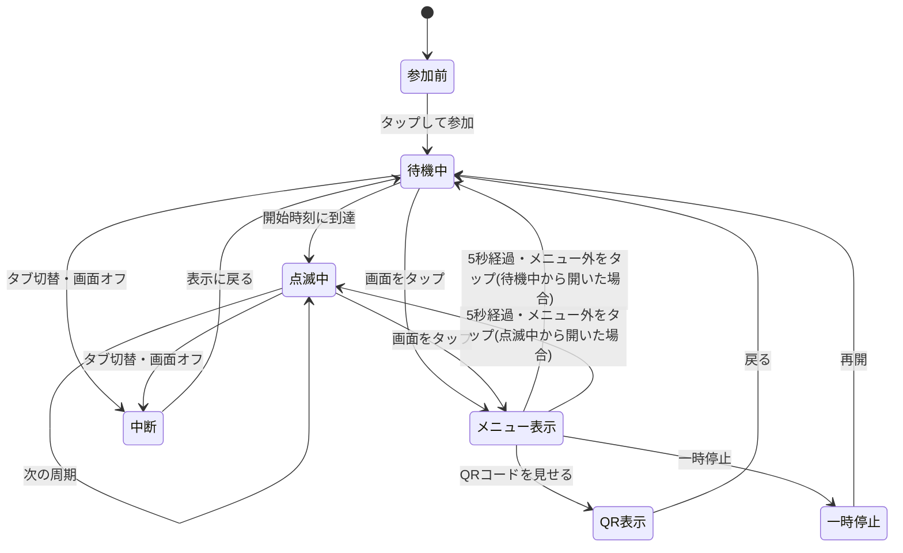

# プロジェクト用語集 (Glossary)

## 概要

このドキュメントは、モールスシンクのドキュメント・コード・画面の文言で使う用語の定義を管理する。
同じものを別の言葉で呼ばないよう、迷ったときは本書の「推奨する表記」に従う。

**更新日**: 2026-09-24

## 表記の統一

| 推奨する表記 | 使わない表記 | 補足 |
|------------|------------|------|
| 1拍 | ユニット、単位時間、ドット長 | コードでは `unit`(例: `unitMs`)。画面・ドキュメントでは「1拍」 |
| 短点 / 長点 | ドット / ダッシュ、トン / ツー | コード内の符号では `.` / `-`、画面表示では `・` / `−` |
| 同期の周期 | ループ時間、間隔、サイクル | コードでは `period`(例: `periodSec`)。画面には表示しない |
| 1周 / 1周分の所要時間 | 1ループ、メッセージ長 | コードでは `cycle`(例: `cycleMs`) |
| 開始時刻 | スタート時刻、同期時刻 | 周期で割り切れる時刻 |
| 点灯 / 消灯 | 発光 / 非発光、ON / OFF | コードでは `isOn` |
| 点灯色 | 発光色、表示色 | URLの `c` |
| 作成画面 / 参加画面 | 主催者画面 / 参加者画面、設定画面 / 再生画面 | 画面は役割ではなく用途で呼ぶ(主催者も参加画面を使うため) |
| フラッシュ | ライト、LED | 技術的な文脈では「トーチ」も可(`torch` 制約) |
| QRコード | QR | 画面の文言では必ず「QRコード」 |

## ドメイン用語

### モールスシンク (morse-sync)

**定義**: 複数人のスマホで同じモールス信号をほぼ同時に光らせるWebサービス。本プロダクトの名称

**説明**: 主催者が作った点滅パターンをQRコードで配り、参加者は読み取ってタップするだけで参加できる。各端末の時計を基準に同期するため、サーバーや端末同士の通信を使わない

**英語表記**: morse-sync(リポジトリ名・URLのパス)

### 主催者 (Host)

**定義**: 作成画面で点滅パターンを作り、QRコードや共有URLで参加者に配る人

**関連用語**: 参加者、作成画面

**使用例**:
- 「主催者がQRコードを表示する」

### 参加者 (Participant)

**定義**: QRコードや共有URLから参加画面を開き、点滅に加わる人。主催者自身が参加者を兼ねることもある

**説明**: 参加者は点滅中でもQRコードを表示して、他の人に配ることができる(参加者から参加者へ広がる)

**関連用語**: 主催者、参加画面、参加

### 点滅パターン (Pattern)

**定義**: どのメッセージを、どの速さ・色・周期で光らせるかの設定一式

**説明**: メッセージ・1拍の長さ・点灯色・同期の周期・文字の種類・仕様バージョンからなる。すべてURLのハッシュに格納される。「設定」とだけ書いた場合も点滅パターンを指す

**関連用語**: 設定URL、PatternConfig

**英語表記**: Pattern(データモデル名は `PatternConfig`)

### メッセージ (Message)

**定義**: モールス信号で送る文字列。正規化後に1〜50文字

**説明**: MVPでは欧文の対応文字(英字・数字・一部の記号・空白)のみ。空白は単語の区切りになる

**関連用語**: 正規化、対応外の文字、欧文

**使用例**: `HELLO`、`SOS`、`HELLO WORLD`

### 1拍 (Unit)

**定義**: モールス信号の時間の最小単位。短点1つを点灯する長さ

**説明**: 他のすべての長さ(長点・各種の間隔)は1拍の整数倍で決まる。既定値250ms、範囲200〜2000ms。下限200msは端末間の微差の吸収と光過敏への配慮による

**関連用語**: 短点、長点、符号内の間隔、文字間の間隔、単語間の間隔

**使用例**:
- 「1拍250msのとき、長点は750ms点灯する」

**英語表記**: unit(`unitMs`)

### 符号 (Code)

**定義**: 1文字を表す短点と長点の並び

**説明**: 内部では `.` と `-` の文字列(例: A → `.-`)で持ち、画面では `・` と `−`(例: `・−`)で表示する

**関連用語**: 変換表、短点、長点

### 短点 / 長点 (Dot / Dash)

**定義**: 短点は1拍の点灯、長点は3拍の点灯

**関連用語**: 1拍、符号

### 符号内の間隔 / 文字間の間隔 / 単語間の間隔 (Intra-character gap / Inter-character gap / Word gap)

**定義**: 消灯する長さの3種類。受け手はこの長さで、同じ文字の途中か、次の文字か、次の単語かを見分ける

| 名称 | 長さ | 意味 |
|------|-----|------|
| 符号内の間隔 | 1拍 | 同じ文字の中の、短点・長点どうしのすき間 |
| 文字間の間隔 | 3拍 | 文字と文字の境目 |
| 単語間の間隔 | 7拍 | 単語と単語の境目(メッセージ中の空白) |

**使用例**:
- `・`+消灯1拍+`−` は A(1文字)、`・`+消灯3拍+`−` は E と T(2文字)

**関連用語**: ITU-R M.1677

### 区切り(周の末尾の区切り)

**定義**: 1周の最後に置く7拍の消灯。単語間の間隔と同じ長さ

**説明**: 次の周の先頭が前の周の末尾と続けて読まれないようにする。1周分の所要時間に含める

**関連用語**: 1周分の所要時間、単語間の間隔

### 1周 / 1周分の所要時間 (Cycle / Cycle duration)

**定義**: 1周は、メッセージを先頭から最後まで1回送ること。1周分の所要時間は、メッセージを送る時間に区切り(7拍)を加えた長さ

**計算式**:
```
1周分の所要時間(ms) = (送信の拍数 + 7) × 1拍の長さ(ms)
```

**説明**: 作成画面に「メッセージの長さ」として表示する唯一の時間(モールス信号を知らない人にも分かるよう、画面では「1周」という言葉を使わない)。60秒を超えるとQRコードを生成しない

**使用例**: `SOS`(1拍250ms)は (27 + 7) × 250 = 8,500ms = 8.5秒

**英語表記**: cycle(`cycleMs`)

### 同期の周期 (Sync period)

**定義**: メッセージを繰り返し送る間隔。すべての参加端末が同じ時刻に1周を始めるための基準

**説明**: 60の約数(1・2・3・4・5・6・10・12・15・20・30・60秒)のうち、1周分の所要時間以上で最短のものを内部で自動決定する。ユーザーは入力も確認もしない(画面に表示しない)。URLの `p` に入り、参加側はその値をそのまま使う

**関連用語**: 開始時刻、1周分の所要時間、周期の自動決定

**使用例**:
- 所要時間8.5秒 → 周期10秒(1.5秒は消灯のまま待つ)

**英語表記**: period(`periodSec`)

### 開始時刻 (Cycle start)

**定義**: 1周の送信を始める時刻。UNIX時刻が同期の周期で割り切れる時刻

**説明**: 周期が60の約数なので、毎分0秒は必ず開始時刻になる。参加した直後は、次に来る開始時刻まで待機中となる

**使用例**:
- 周期15秒なら、毎分0秒・15秒・30秒・45秒が開始時刻

**関連用語**: 同期の周期、待機中

### 点灯色 / 消灯色

**定義**: 点灯色は点灯中の画面の色(既定 `#ffcc00`、URLの `c`)。消灯色は消灯中の画面の色で、MVPでは黒(`#000000`)に固定

**関連用語**: 画面点滅

### 画面点滅 (Screen flashing)

**定義**: 画面全体を点灯色と黒で切り替えてモールス信号を表すこと。MVP(P0)の出力方法

**説明**: カメラ等の許可が不要で、どの端末でも動く

**関連用語**: フラッシュ、出力先

### フラッシュ (Flash / Torch)

**定義**: スマホのカメラ用ライト(トーチ)を点灯・消灯させてモールス信号を表すこと。本プロダクトの本命機能(P1)

**説明**: カメラの許可が必要なため、参加者が選んだ場合だけ使う。撮影・録画はしない。技術的にはカメラの映像トラックの `torch` 制約で制御する

**関連用語**: 画面点滅、出力先

### 欧文 / 和文 (English / Japanese Morse)

**定義**: 欧文はアルファベット・数字・記号のモールス符号(MVP)。和文はひらがな・カタカナのモールス符号(P1)

**説明**: URLの `l` で区別する(`en` / `ja`)。和文では濁点・半濁点を独立した符号として送る

**関連用語**: 変換表、文字の種類

### 変換表 (Morse table)

**定義**: 文字と符号の対応表。プログラム本体から分離したデータとして持つ

**実装箇所**: `public/js/core/tables/en.js`(P1で `ja.js`)

**関連用語**: 符号、欧文 / 和文

### 正規化 (Normalization)

**定義**: メッセージの表記の揺れをそろえる処理

**説明**: 欧文では、前後の空白の削除、連続する空白を1つにまとめる、英字の大文字化を行う。対応外の文字は消さずに残し、報告する

**使用例**:
```
入力: "  hello   world "
出力: "HELLO WORLD"
```

### 対応外の文字 (Unsupported character)

**定義**: 変換表に符号がない文字(欧文モードでの日本語・絵文字・全角英字など)

**説明**: 作成画面で強調表示し「この文字は送れません: あ」と表示する。1文字でもあればQRコードを生成しない

### 設定URL / 共有URL (Pattern URL / Share URL)

**定義**: 点滅パターンをハッシュに含むURL。QRコードの中身であり、「共有」ボタンで送るURL

**使用例**:
```
https://nogawa-asase.github.io/morse-sync/#v=1&l=en&m=HELLO&p=15&u=250&c=ffcc00
```

**関連用語**: ハッシュ、仕様バージョン

### ハッシュ (Hash)

**定義**: URLの `#` より後ろの部分。点滅パターンの格納場所

**説明**: サーバーに送信されず、ページを再読み込みせずに書き換えられる。ハッシュの有無で作成画面と参加画面を切り替える

**URLのキー**:

| キー | 意味 | 内部の名前 |
|-----|------|----------|
| `v` | 仕様バージョン | `version` |
| `l` | 文字の種類 | `lang` |
| `m` | メッセージ | `message` |
| `p` | 同期の周期(秒) | `periodSec` |
| `u` | 1拍の長さ(ms) | `unitMs` |
| `c` | 点灯色 | `color` |

### 仕様バージョン (Spec version)

**定義**: URLの形式と意味の版(URLの `v`)。現在は `1`

**説明**: 配布済みのQRコードを将来も同じように動かすための番号。既存項目の意味や計算方法を変えるときに上げる。未知の版のURLでは点滅せず、再読み込みを案内する

### 作成画面 / 参加画面 (Create screen / Join screen)

**定義**: 作成画面は点滅パターンを作りQRコードを表示する画面(ハッシュなしで開いたとき)。参加画面は点滅に参加する画面(有効なハッシュ付きで開いたとき)

**関連用語**: 主催者、参加者、ハッシュ

### 参加 (Join)

**定義**: 参加画面で「タップして参加」を押し、スリープ防止・フルスクリーン・点滅を開始すること

**説明**: 1回のタップで必要な準備をすべて行う(ブラウザの制約で、スリープ防止などはユーザー操作をきっかけにしか有効にできないため)

## 技術用語

### Screen Wake Lock API

**定義**: 画面が自動で消えないようにするブラウザAPI

**公式サイト**: https://developer.mozilla.org/ja/docs/Web/API/Screen_Wake_Lock_API

**本プロジェクトでの用途**: 参加中のスリープ防止。タブ切替・画面オフで解除されるため、表示に戻ったときに再取得する。非対応なら案内のみ表示

**関連ドキュメント**: `docs/architecture.md` ブラウザAPI

### Fullscreen API

**定義**: 要素を全画面表示にするブラウザAPI

**本プロジェクトでの用途**: 参加時の全画面表示。iPhone Safariは非対応のため、その場合は通常表示で継続する

### Web Share API / Clipboard API

**定義**: Web Share APIはOSの共有シートを開くAPI。Clipboard APIはクリップボードに書き込むAPI

**本プロジェクトでの用途**: 「共有」ボタン。共有シートがなければURLをコピーする

### トーチ制約 (torch constraint)

**定義**: カメラの映像トラックに `applyConstraints({ advanced: [{ torch: true }] })` を与えてライトを点灯させる方法

**本プロジェクトでの用途**: フラッシュ機能(P1)。映像は表示・保存しない

### Service Worker / PWA

**定義**: Service Workerはページの読み込みを仲介し、ファイルを端末に保存できる仕組み。PWA(Progressive Web App)はそれを使ってWebページをアプリのように使えるようにする技術の総称

**本プロジェクトでの用途**: オフライン対応(P1)。一度開けば圏外でもQRコードから参加できるようにする

### requestAnimationFrame(rAF)

**定義**: 画面の描画タイミングごとに処理を呼び出すブラウザAPI

**本プロジェクトでの用途**: 毎フレームの点灯判定。背景タブでは止まる

### Date.now()

**定義**: 現在のUNIX時刻(1970-01-01T00:00:00Zからのミリ秒)を返す関数

**本プロジェクトでの用途**: 同期の唯一の基準。端末間で共有できる基準は壁時計だけであるため。`performance.now()` は端末ごとに起点が違うため同期には使わない

### qrcode-generator

**定義**: QRコードを生成するJavaScriptライブラリ(MIT)

**本プロジェクトでの用途**: 設定URLのQRコードをSVGで描画する。`public/vendor/` に同梱し、配信物に含める唯一の外部ライブラリ

### ES Modules

**定義**: JavaScript標準のモジュールの仕組み(`import` / `export`)

**本プロジェクトでの用途**: ビルドなしでファイルを分割する。`import` のパスは拡張子 `.js` まで書く

### JSDoc

**定義**: コメントで型や説明を書く記法

**本プロジェクトでの用途**: TypeScriptを使わずに型を記述し、`tsc --noEmit`(`jsconfig.json`)で型検査する

### Vitest

**定義**: JavaScriptのテストフレームワーク

**本プロジェクトでの用途**: ドメイン層(`public/js/core/`)のユニットテスト。開発時のみ使い、配信物に含めない

### GitHub Pages

**定義**: GitHubのリポジトリから静的ファイルをHTTPSで公開するサービス

**本プロジェクトでの用途**: `public/` の公開先。GitHub Actionsで `main` へのpush時に公開する

## 略語・頭字語

### MVP

**正式名称**: Minimum Viable Product

**意味**: プロダクトとして成立する最小限の機能セット

**本プロジェクトでの使用**: P0の機能1〜5(点滅パターンの作成、QRコードでの設定共有、設定URLの読み込み、参加開始の操作、時刻同期による画面点滅)

### P0 / P1 / P2

**意味**: 機能の優先度。P0は必須(MVP)、P1は重要(MVPの後すぐ)、P2はできれば

**本プロジェクトでの使用**: フラッシュはP1だが、重要度が低いのではなく「画面点滅の同期を完成させてから載せる」という実装順の都合による

### ITU-R M.1677

**正式名称**: International Telecommunication Union Radiocommunication Sector Recommendation M.1677(International Morse code)

**意味**: 国際電気通信連合によるモールス符号の勧告

**本プロジェクトでの使用**: 短点・長点・各種の間隔の拍数の比率(1:3、1・3・7)の根拠

### WCAG 2.3.1

**正式名称**: Web Content Accessibility Guidelines 2.x 達成基準 2.3.1(3回の閃光、又は閾値以下)

**意味**: 1秒間に3回を超えて点滅するコンテンツを避けるという基準

**本プロジェクトでの使用**: 1拍の下限200msの根拠(短点の連続でも1秒に2.5回)

### WPM

**正式名称**: Words Per Minute

**意味**: 1分間に送れる単語数。モールスの速さの一般的な目安。`1200 ÷ 1拍のms` で求まる

**本プロジェクトでの使用**: 画面には表示しない。ドキュメントで速さの目安を説明するときのみ使う(1拍250msは約4.8WPM)

### CSP

**正式名称**: Content Security Policy

**意味**: ページが読み込める・通信できる先を制限する仕組み

**本プロジェクトでの使用**: `index.html` の `<meta>` で指定し、外部リソースと通信(`connect-src 'none'`)を禁止する

### UNIX時刻

**意味**: 1970-01-01T00:00:00Z(UTC)からの経過時間

**本プロジェクトでの使用**: 開始時刻の計算の基準。UNIX時刻0は分の0秒なので、60の約数の周期で割り切れる時刻はどの端末でも一致する

## アーキテクチャ用語

### レイヤー(core / player / platform / ui)

**定義**: `public/js/` 直下の4つのディレクトリで表す責務の区分

| レイヤー | 名称 | 責務 |
|---------|------|------|
| `core/` | ドメイン層 | モールスの規則・周期・時刻からの判定・URLの変換と検証。DOM非依存 |
| `player/` | 再生層 | 毎フレームの点灯判定と出力先への通知 |
| `platform/` | プラットフォーム層 | ブラウザAPIの薄いラッパー |
| `ui/` | プレゼンテーション層 | 画面・操作・文言 |

**図解**:
```
ui/ ──→ player/ ──→ core/
 │                   ↑
 ├──────────────────┘
 └──→ platform/ ──→ vendor/
```

**関連ドキュメント**: `docs/architecture.md`、`docs/repository-structure.md`

### 出力先 (Output)

**定義**: 点灯・消灯を実際の光や音に変えるもの。`setOn(isOn)` と `dispose()` を持つ

**本プロジェクトでの適用**: `ScreenOutput`(画面点滅、P0)、`TorchOutput`(フラッシュ、P1)、`BeepOutput`(音、P2)。Playerは出力先の種類を知らずに通知する

### 同梱ライブラリ (Vendored library)

**定義**: npmから実行時に読み込むのではなく、ファイルをリポジトリにコピーして配信物に含める外部ライブラリ

**本プロジェクトでの適用**: `public/vendor/qrcode-generator.js`。改変せず、版とライセンスをファイル先頭に記載する

### ビルドなし (No-build)

**定義**: 書いたソースを変換せず、そのままブラウザで実行・配信する方針

**本プロジェクトでの適用**: `public/` の中身がそのまま公開物。テスト・型検査・静的解析は開発時にだけ行う

## ステータス・状態

### 参加画面の状態

| 状態 | 意味 | 遷移条件 | 次の状態 |
|------|------|---------|---------|
| 参加前 | 「タップして参加」を表示 | タップ | 待機中 |
| 待機中 | 最初の開始時刻を待っている。カウントダウン表示 | 開始時刻に到達 | 点滅中 |
| 点滅中 | 点滅パターンに従って点灯・消灯している | (周期ごとに繰り返す) | 点滅中 |
| メニュー表示 | 点滅を続けたまま画面下部にメニューを表示 | 5秒経過・メニュー外をタップ / 項目の選択 | 開く前の状態(待機中・点滅中) / QR表示 / 一時停止 |
| QR表示 | 点滅を止め、白背景にQRコードを表示 | 「戻る」 | 待機中(次の開始時刻から) |
| 一時停止 | 消灯して「再開」を表示 | 「再開」 | 待機中(次の開始時刻から) |
| 中断 | タブ切替・画面オフで止まっている | 表示に戻る | 待機中(次の開始時刻から) |

「待機中」と「点滅中」をまとめて「実行中」と呼ぶ。

**状態遷移図**:


### PlaybackState の phase

| 値 | 意味 |
|----|------|
| `waiting` | 最初の開始時刻より前(待機中) |
| `playing` | 最初の開始時刻以降(点滅中。周期内の区切り・待ち時間の消灯も含む) |

## データモデル用語

### PatternConfig

**定義**: 検証済みの点滅パターン

**主要フィールド**:
- `version`: 仕様バージョン(`1`)
- `lang`: 文字の種類(`'en'`)
- `message`: 正規化済みメッセージ
- `periodSec`: 同期の周期(秒)
- `unitMs`: 1拍の長さ(ms)
- `color`: 点灯色(小文字16進6桁)

**制約**: `periodSec × 1000 ≥ 1周分の所要時間`、`periodSec` は60の約数

**定義箇所**: `public/js/core/types.js`

### EncodedMessage / Timeline / OnSegment

**定義**:
- `EncodedMessage`: メッセージを文字ごとの符号にしたもの。対応外の文字の一覧を含む
- `Timeline`: 1周分の点灯区間の列と、1周の拍数(`totalUnits`、区切りを含む)
- `OnSegment`: 1つの点灯区間(開始拍・終了拍・どの文字か)

**定義箇所**: `public/js/core/types.js`

### PlaybackState

**定義**: ある時刻の再生状態(`phase`、`isOn`、送信中の文字、次の開始時刻までのms)。毎フレーム計算し、保存しない

## エラー・例外

入力とURLの誤りは例外ではなく `ValidationResult` の `errors` として返す。

| エラーコード | 発生条件 | 画面の文言 |
|------------|---------|----------|
| `UNSUPPORTED_CHARS` | 対応外の文字を含む | この文字は送れません: あ |
| `EMPTY_MESSAGE` | 正規化後に空 | メッセージを入力してください |
| `MESSAGE_TOO_LONG` | 正規化後に50文字超 | メッセージは50文字以内にしてください |
| `UNIT_OUT_OF_RANGE` | 1拍が整数でない、200〜2000ms外 | 1拍の長さは200〜2000ミリ秒で入力してください |
| `TOO_LONG_FOR_60S` | 1周分の所要時間が60秒超 | 60秒以内に収まりません。メッセージを短くするか、1拍を短くしてください |
| `INVALID_COLOR` | 色が16進6桁でない | (作成画面)点灯色は #ffcc00 のように6桁で入力してください /(参加画面)QRコードの内容が正しくありません |
| `UNKNOWN_VERSION` | `v` が未知の版 | このQRコードは新しいバージョン用です。ページを再読み込みしてください |
| `UNKNOWN_LANG` | `l` が未対応の文字の種類 | QRコードの内容が正しくありません |
| `MISSING_FIELD` | 必須項目(`v` `m` `p`)がない | QRコードの内容が正しくありません |
| `INVALID_PERIOD` | `p` が60の約数でない、または所要時間より短い | QRコードの内容が正しくありません |

**定義箇所**: エラーコードは `public/js/core/types.js`、文言は `public/js/ui/messages.js`

## 計算・アルゴリズム

### 周期の自動決定

**定義**: 1周分の所要時間以上となる60の約数のうち、最短のものを選ぶ

**計算式**:
```
周期(秒) = min { p ∈ [1,2,3,4,5,6,10,12,15,20,30,60] | p × 1000 ≥ 1周分の所要時間(ms) }
該当なし → 60秒に収まらない(QRコードを生成しない)
```

**実装箇所**: `public/js/core/period-planner.js`

**例**:
```
入力: 8,500ms  → 出力: 10秒
入力: 10,000ms → 出力: 10秒
入力: 10,100ms → 出力: 12秒
入力: 60,100ms → 出力: なし
```

### 時刻からの点灯判定

**定義**: 現在時刻から周期内の位置(拍)を求め、点灯区間に含まれるかで点灯・消灯を決める

**計算式**:
```
周期の開始時刻 = floor(現在時刻 ÷ 周期ms) × 周期ms
経過拍数       = (現在時刻 − 周期の開始時刻) ÷ 1拍ms
点灯           = 経過拍数を含む点灯区間がある
```

**説明**: 前回からの経過を積み上げず毎回現在時刻から求めるため、誤差が蓄積しない

**実装箇所**: `public/js/core/sync-clock.js`
